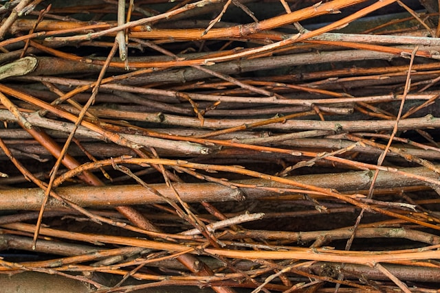

```{r setup-1, echo=FALSE, message=FALSE, warning=FALSE}
knitr::opts_chunk$set(
  echo        = FALSE,
  message     = FALSE,
  warning     = FALSE,
  fig.align   = "center",
  out.width   = "100%",
  dev         = "png",
  dpi         = 150,
  cache       = FALSE
)

suppressPackageStartupMessages({
  library(magick)
  library(dplyr)
  library(plotly)
  library(ggplot2)
  library(tidyr)
  library(patchwork)
  library(knitr)
  library(kableExtra)
  library(sf)
  library(tibble)
  library(stringr)
  library(leaflet)
  library(osrm)
  library(ROI)
  library(ROI.plugin.glpk)
  library(gurobi)
  library(ROI.plugin.gurobi)
  library(ggrepel)
  library(ggnewscale)
  library(rnaturalearth)
  library(rnaturalearthdata)
  library(Rcpp)
  library(RcppArmadillo)
  library(scatterpie)
  library(networkD3)
  library(htmlwidgets)
  library(webshot2)
  library(ggalluvial)
  library(scales)
  library(purrr)
  library(broom)
  library(RefManageR)
  library(xaringanExtra)
  library(collapsibleTree)
  library(tikzDevice)
  library(pdftools)
})

xaringanExtra::use_logo(
  image_url = "fig/ikts_logo.png",
  width      = "150px",
  height     = "auto",
  position   = xaringanExtra::css_position(top = "10px", right = "15px"),
  exclude_class = c()
)

xaringanExtra::use_progress_bar(
  color    = "#179C7D",
  location = "top",
  height   = "4px"
)


xaringanExtra::use_tile_view()
xaringanExtra::use_broadcast()

BibOptions(
  check.entries = FALSE,
  bib.style     = "authoryear",
  cite.style    = "authoryear",
  style         = "markdown",
  hyperlink     = FALSE,
  dashed        = FALSE,
  max.names      = 2,
  longnamesfirst = FALSE
)
bib <- ReadBib("literature.bib", check = FALSE)
```


```{r setup-2, echo=FALSE, message=FALSE, warning=FALSE, cache=TRUE}
source("../../Modell/!afs_biomass_setup.r")
source("../../Modell/extract_result.R")
source("../../Modell/!helper_func.r")
source("../../Modell/!helper_instance_builder_v8a.R")
source("../../Modell/!build_AFS_milp.r")
Rcpp::sourceCpp("../../Modell/build_and_solve_afs_lp_v11.cpp")

load("../../Paper/afs_workspace_red.RData")

sites_sf         <- afs_workspace$sites_sf
sites            <- afs_workspace$sites
sites_clustered  <- afs_workspace$sites_clustered
storages         <- afs_workspace$storages
consumers        <- afs_workspace$consumers

# Scale down industrial demand quantities
consumers <- consumers %>%
  mutate(demand_P1 = demand_P1 / 5)

# Drop small Biogas plants (total demand < 1.5 kt/yr)
consumers <- consumers %>%
  mutate(total_demand = demand_P1 + demand_P2 + demand_P3) %>%
  filter(total_demand >= 1.5) %>%
  select(-total_demand)

dist_jk <- afs_workspace$dist_jk[, consumers$consumer_id]

# Gompertz yield scenario: N=250 trees/ha, conservative site quality
yields_by_age <- build_scenario_ts(
  ages   = 1:20,
  N      = 250,
  C_site = 6.500,
  k      = 0.194,
  t0     = 9.7,
  label  = "Conservative (250 trees/ha)"
)

yields_by_age <- yields_by_age %>%
  select(-scenario) %>%
  pivot_longer(-1, names_to = "product", values_to = "yield_ha") %>%
  mutate(product = as.integer(as.character(factor(product, labels = c(2, 1, 3)))))

# Convert dry-matter yields to fresh-weight (moisture content omega = 0.50)
yields_by_age$yield_ha <- yields_by_age$yield_ha / (1 - 0.5)

set.seed(123578)
c.opp.vec <- rnorm(nrow(sites_clustered), 1, .75)

sites_clustered <- sites_clustered %>%
  mutate(
    C_est  = 2500,           # €/ha  establishment cost
    C_harv =  150,           # €/ha  harvest cost
    C_main =   10,           # €/ha  annual maintenance cost
    C_opp  = 150 * c.opp.vec # €/ha  annual opportunity cost
  )

storages$CAP_stor <- storages$CAP_stor * 100000
storages$CAP_proc <- storages$CAP_proc * 100000

data_obj <- list(
  sites         = sites_clustered,
  storages      = storages,
  consumers     = consumers,
  dist_ij       = afs_workspace$dist_ij_clust,
  dist_jk       = dist_jk,
  yields_by_age = yields_by_age
)

data_obj$consumers[, c("demand_P1", "demand_P2", "demand_P3")] <-
  data_obj$consumers[, c("demand_P1", "demand_P2", "demand_P3")] * 1000

params_obj <- list(
  n_periods = 40,
  max_age   = 15L,   # A_max: upper rotation bound
  min_age   =  3L,   # A_min: lower rotation bound
  c_tr_raw  = 0.08,  # €/(t·km) raw biomass site → storage
  c_tr_pre  = 0.06   # €/(t·km) chips      storage → consumer
)

milp_instance <- build_optimization_instance(
  data   = data_obj,
  params = params_obj
)

result        <- readRDS("../../Paper/result_lp_v11.rds")
ext           <- result$solution_vector

ext$Xjk <- ext$Xjk %>%
  rename(src_product = p, del_product = q, period = t, hub_id = j, consumer_id = k)
ext$Xij <- ext$Xij %>%
  rename(period = t, site_id = i, hub_id = j)
ext$z   <- ext$z %>%
  rename(arc_type = type, site_id = i)
ext$S   <- ext$S %>%
  rename(hub_id = j, period = t)

res.sens.list <- readRDS("../../Paper/res_sens_list_lp_v11.rds")
```


## Overview

1. **Introduction**
2. **AFS Systems, Value Creation & Biomass Growth**
3. **MILP Model for AFS Supply Chain Design (AFS-SCD)**
4. **Case Study: Saxony-Anhalt**
5. **Conclusion & Outlook**

---
class: inverse, center, middle

# Introduction


---

## What is the Bioeconomy?

.pull-left[
> **"The bioeconomy encompasses the production of renewable biological resources and their conversion into food, feed, bio-based products, and bioenergy."** .small[— European Commission, 2012; updated strategy 2018]

- 🌾 **Biomass** as the primary feedstock (agriculture, forestry, marine)
- 🔬 **Biotechnology** enabling valorisation at molecular level
- ♻️ **Circular economy** integration — cascading use of resources substitution of fossil feedstocks
]

.pull-right[
**Scope of the EU Bioeconomy (2024)**

| Indicator | Value |
|-----------|-------|
| Gross value added | € 2.7 trillion |
| Employment | 17.1 million jobs |
| Share of EU GDP | ~11–16 % |
| Share of EU employment | ~8 % |
]

---

## Growth Potentials: market segments — size & growth

.pull-left[
| Segment | Market 2025 | CAGR to 2030/34 |
|---------|-------------|-----------------|
| Bio-based chemicals (global) | $ 110–120 bn | **9.6 %** |
| Bio-based polymers (production) | 4.5 mio. t | **11.0 %** |
| Biorefineries (global) | $ 57–146 bn | **7.8–9.6 %** |
| Biofuels (global) | ~$ 145 bn | **5.8 %** |
| Bioplastics (global) | $ 11.9 bn | **8.1 %** |
]

.pull-right[
📦 **Bio-based polymers**
capacity target: 8.5 mio. t by 2030 Bio-PP: +94 % new capacity 

🧪 **Platform chemicals**
Succinic acid, lactic acid — CAGR 5.9 %; market $ 28 bn by 2035

💊 **Biopharmaceuticals (DE)**
€ 19.2 bn revenue (2023); 34.5 % market share — fastest-growing pharma sub-sector
]

---

## Biobased plastics

```{r, echo=FALSE, out.width="90%", fig.align="center"}
knitr::include_graphics("fig/motivation_upm.png")
```

.callout-block[
.medium[
Total wood production in Germany: ~27 mill. t dry wood (2024), of which ~4–5 mill. t is beech `r Citep(bib, "StatistischesBundesamt2026_WoodProduction")`.
UPM Biochemicals (Leuna) demands ~10 % of German beech production for biochemical conversion `r Citep(bib, "upmBiochemicals2024")`.]
]

---

## Feedstocks - Trees in agricultural systems

.col-50[

.medium[
**Short-Rotation Coppice (SRC)**
- Monoculture, 8,000–20,000 trees/ha
- Rotation: 3–7 years; lifetime: 20–25 years
- No inter-row crop production 
]

.center[

]

]

--

.col-50[

.medium[
**Agroforestry systems (AFS)**
- 1–4 tree rows in alley-cropping
- 10–30 % of total parcel area $\rightarrow$ 400-800 trees/ha
- Edge-tree effect $\rightarrow$ higher individual-tree biomass 
]

.center[

]

]

---

## AFS potential in Germany

.col-40[
<a href="https://defaf.map.agroforestry-map.eu/de" target="_blank" rel="noopener">
```{r, echo=FALSE, out.width="95%", fig.align="center"}
knitr::include_graphics("fig/motivation_defaf.png")
```
</a>
]

.col-60[
- In Germany, ~1,200 ha of silvoarable AFS established in 2025 (≈ 0.02 % of agricultural land) `r Citep(bib, "DEFAF")`
- Total agricultural land: ~17 mill. ha → potential AFS area: 1–2 mill. ha (6–12 %)
- Gross wood potential from AFS: 10–30 mill. t dry wood per year

.callout-block[
  **Research question:** How can AFS-based biomass supply chains be designed to make AFS economically attractive for farmers and industries?
]
]

---
class: inverse, center, middle

# AFS Systems, Value Creation & Biomass Growth

---

## Economics of Agroforestry Systems

.callout-block[.small[
Profitability depends critically on which value chains absorbs harvested biomass fractions.
]
]

.col-40[
```{r afs-tree-interactive, echo=FALSE, message=FALSE, warning=FALSE, out.width="100%"}
library("collapsibleTree")

economics <- data.frame(
  Level1 = c(rep("Costs", 5), rep("Returns", 4)),
  Level2 = c(
    "Establishment costs",
    "Maintenance costs",
    "Harvest costs (Arable Crops)",
    "Harvest costs (Timber)",
    "Opportunity costs (land foregone)",
    "Wood biomass revenues",
    "Arable Crop Yield",
    "Agricultural Subsidies & Direct Payments",
    "Carbon Credits & C-Markets"
  )
)

fill_colours <- c(
  "#2d6a2d",
  "#c0392b", "#27ae60",
  rep("#f1948a", 5),
  rep("#a9dfbf", 4)
)

collapsibleTree(
  economics,
  hierarchy  = c("Level1", "Level2"),
  width      = 400,
  height     = 400,
  fontSize   = 18,
  nodeSize   = "leafCount",
  fill       = fill_colours,
  tooltip    = TRUE,
  collapsed  = FALSE
)
```
]

.col-60[
.small[
- **Costs:**
  - Establishment: 1,500–3,500 €/ha for planting, site prep `r Citep(bib, "Faasch2012_SRC_Economics")`
  - Maintenance: ~10 €/ha/yr (pruning, pest management)
  - Harvest: 200–400 €/ha per rotation `r Citep(bib, "Testa2014_Poplar_Economics")`
  - Opportunity: foregone crop revenues (400–600 €/ha/yr in fertile regions)
- **Returns:**
  - Wood & biomass revenues (cascade: stem > branch > residue)
  - Crop yield premium in inter-row strips (+5–15 % relative to open-field) `r Citep(bib, "Graves2007_Agroforestry_Economics")`
  - Subsidies and carbon credits `r Citep(bib, "Toensmeier2017_Carbon_Agroforestry")`
]
]

---
class: compact-slide

## Usage of AFS Biomasses
<!-- FIX 1: NO blank line between h2 and the div -->
<div style="display:grid; grid-template-columns: 250px 1fr; gap: 1.2rem; align-items:start; margin-top:0.3rem; overflow:visible;">

<!-- LEFT COLUMN: Biomass fractions -->
<div style="background:#f4f9f4; border-radius:8px; padding:0.8rem; border-left:4px solid #4a7c2f;">
  <p style="font-weight:700; color:#2d5a1b; font-size:1rem; margin:0 0 0.6rem 0;">🌳 BIOMASS FRACTIONS</p>

  <div style="margin:0.4rem 0; border-radius:4px; overflow:hidden; font-size:0.9rem; background:#2d5a1b; color:white;">
    
    <div style="padding:0.3rem 0.5rem;">🪵 <strong>Stem wood</strong> (Ø &gt;15 cm)</div>
  </div>

  <div style="margin:0.4rem 0; border-radius:4px; overflow:hidden; font-size:0.9rem; background:#4a7c2f; color:white;">
    
    <div style="padding:0.3rem 0.5rem;">🌿 <strong>Large branches</strong> (Ø 7–15 cm)</div>
  </div>

  <div style="margin:0.4rem 0; border-radius:4px; overflow:hidden; font-size:0.9rem; background:#6ea048; color:white;">
    
    <div style="padding:0.3rem 0.5rem;">🍃 <strong>Small branches / leaves</strong> (Ø &lt;7 cm)</div>
  </div>
</div>

<!-- RIGHT COLUMN: Usage pathways -->
<div style="display:grid; grid-template-columns: 1fr 1fr 1fr; gap:0.6rem;">

  <div style="background:#fff; border:1px solid #c8dfc0; border-radius:8px; overflow:hidden; text-align:center;">
    
    <div style="padding:0.5rem 0.7rem 0.7rem;">
      <p style="font-weight:700; font-size:1.5rem; color:#2d5a1b; margin:0.2rem 0 0.3rem 0;">Furniture industry</p>
      <p style="font-size:1rem; color:#555; margin:0; line-height:1.3;">Sawn timber, veneers</p>
      <div style="margin-top:0.4rem; padding:0.15rem; background:#e8f4e0; border-radius:3px; font-size:1rem; color:#4a7c2f;">▶ Stem wood</div>
    </div>
  </div>

  <div style="background:#fff; border:1px solid #c8dfc0; border-radius:8px; overflow:hidden; text-align:center;">
    
    <div style="padding:0.5rem 0.7rem 0.7rem;">
      <p style="font-weight:700; font-size:1.5rem; color:#2d5a1b; margin:0.2rem 0 0.3rem 0;">Paper industry</p>
      <p style="font-size:1rem; color:#555; margin:0; line-height:1.3;">Pulp, fibres, cardboard</p>
      <div style="margin-top:0.4rem; padding:0.15rem; background:#e8f4e0; border-radius:3px; font-size:1rem; color:#4a7c2f;">▶ Stem + large branches</div>
    </div>
  </div>

  <div style="background:#fff; border:1px solid #c8dfc0; border-radius:8px; overflow:hidden; text-align:center;">
    
    <div style="padding:0.5rem 0.7rem 0.7rem;">
      <p style="font-weight:700; font-size:1.5rem; color:#2d5a1b; margin:0.2rem 0 0.3rem 0;">Chemical industry</p>
      <p style="font-size:1rem; color:#555; margin:0; line-height:1.3;">Bioplastics, lignin derivatives, resins</p>
      <div style="margin-top:0.4rem; padding:0.15rem; background:#e8f4e0; border-radius:3px; font-size:1rem; color:#4a7c2f;">▶ Stem + large branches</div>
    </div>
  </div>

  <div style="background:#fff; border:1px solid #c8dfc0; border-radius:8px; overflow:hidden; text-align:center;">
    
    <div style="padding:0.5rem 0.7rem 0.7rem;">
      <p style="font-weight:700; font-size:1.5rem; color:#2d5a1b; margin:0.2rem 0 0.3rem 0;">Energy generation</p>
      <p style="font-size:1rem; color:#555; margin:0; line-height:1.3;">Wood chips, pellets, combined heat & power</p>
      <div style="margin-top:0.4rem; padding:0.15rem; background:#fff3e0; border-radius:3px; font-size:1rem; color:#b45309;">▶ all fractions</div>
    </div>
  </div>

  <div style="background:#fff; border:1px solid #c8dfc0; border-radius:8px; overflow:hidden; text-align:center;">
    
    <div style="padding:0.5rem 0.7rem 0.7rem;">
      <p style="font-weight:700; font-size:1.5rem; color:#2d5a1b; margin:0.2rem 0 0.3rem 0;">Biogas plant</p>
      <p style="font-size:1rem; color:#555; margin:0; line-height:1.3;">Anaerobic digestion, electricity + heat (CHP)</p>
      <div style="margin-top:0.4rem; padding:0.15rem; background:#fff3e0; border-radius:3px; font-size:1rem; color:#b45309;">▶ Leaves + fine brushwood</div>
    </div>
  </div>

</div>
</div>
<!-- FIX 2: blank line BEFORE .footnote is mandatory -->

.footnote[Cascade utilisation following EU Bioeconomy Strategy (2018); fraction assignment: own classification]

---

## Modelling Biomass Growth – Gompertz Stand Model

.col-40[
.small[
**Stand-level Gompertz model:**
$$M(t) = A \cdot e^{-e^{-k \cdot (t - t_0) }}$$

- $A$ — asymptotic biomass quantity
- $t_0 \in [9, 10]$ - inflection point $\rightarrow$ maximal growth rate
- $k \in [0.17, 0.2]$ shape/skewness of grwoth curve
 

**Compartment fractions** (logistic model):
$$q_p(t) = \frac{f_p}{1 + \exp(-r_p \cdot (t - t_{50,p}))}$$

Calibrated for stem ($d > 15$ cm) and branches ($d > 7$ cm) $\rightarrow$ residue defined as rest
`r Citep(bib, "Jha2018_Poplar_AFS_Biomass")`; `r Citep(bib, "Civitarese2019_Poplar_Harvest")`
]
]

.col-60[
```{r max3-growth, fig.width=6, out.width="90%", cache=TRUE}
age.vec <- seq(0, 20, by = 0.1)

cons <- build_scenario_ts(ages = age.vec, N = 300, C_site = 6.500, k = 0.194, t0 = 9.7,
                          label = "Conservative (250 trees/ha)")

comp_long <- bind_rows(cons) |>
  rename(stem = "Merch. stem", branch = "Merch. branch", residue = Residue) %>%
  pivot_longer(c("stem", "branch", "residue"),
               names_to = "component", values_to = "biomass") |>
  mutate(component = factor(component, levels = c("residue", "branch", "stem"))) %>%
  select(-scenario)

emp_pts <- tribble(
  ~age, ~AGB,   ~p_stem, ~p_branch,
   8,   134.3,  0.747,   0.166,
   9,    74.0,  0.830,   0.110,
   9,    51.5,  0.920,   0.040,
  10,   119,    0.76,   0.210,
  13,   152.0,  0.770,   0.220
) |>
  mutate(stem_cum   = AGB * p_stem,
         branch_cum = AGB * (p_stem + p_branch),
         total      = AGB)

emp_long <- bind_rows(
  emp_pts |> transmute(age, biomass = stem_cum,   series = "Empirical: stem"),
  emp_pts |> transmute(age, biomass = branch_cum, series = "Empirical: stem+branches"),
  emp_pts |> transmute(age, biomass = total,      series = "Empirical: total biomass")
) |> mutate(series = factor(series, levels = c(
  "Empirical: stem", "Empirical: stem+branches", "Empirical: total biomass")))

emp_col   <- c("Empirical: stem" = "darkgreen",
               "Empirical: stem+branches" = "darkorange",
               "Empirical: total biomass" = "navy")
emp_shape <- c("Empirical: stem" = 21L,
               "Empirical: stem+branches" = 24L,
               "Empirical: total biomass" = 23L)

p <- ggplot(comp_long, aes(x = age, y = biomass)) +
  annotate("rect", xmin = 5, xmax = 15, ymin = 0, ymax = Inf,
           fill = "grey80", alpha = 0.25) +
  geom_area(aes(fill = component),
            position = "stack", alpha = 0.70, colour = "white", linewidth = 0.2) +
  geom_point(data = emp_long,
             aes(x = age, y = biomass, colour = series, shape = series, fill = series),
             size = 2.5, alpha = 0.90, inherit.aes = FALSE) +
  scale_fill_manual(name   = "Biomass fraction",
                    values = c("stem" = "#1b9e77", "branch" = "#d95f02", "residue" = "#7570b3"),
                    breaks = c("stem", "branch", "residue")) +
  scale_colour_manual(name = "Empirical data", values = emp_col) +
  scale_shape_manual (name = "Empirical data", values = emp_shape) +
  guides(
    fill   = guide_legend(order = 1, override.aes = list(shape = NA, colour = NA, linetype = 0)),
    colour = guide_legend(order = 3, override.aes = list(
                shape = emp_shape[levels(emp_long$series)], size = 2.5,
                fill  = emp_col[levels(emp_long$series)])),
    shape  = "none") +
  scale_x_continuous(breaks = seq(0, 20, 2)) +
  labs(x = "Stand age (years)", y = "biomass (t DM/ha)",
       caption = "Grey band: typical medium-rotation harvest window (5–15 years).") +
  theme_minimal(base_size = 9) +
  theme(legend.position = "top",
        legend.key.size = unit(0.4, "cm"),
        legend.text     = element_text(size = 7),
        legend.title    = element_text(size = 8, face = "bold"),
        panel.grid.minor = element_blank())

ggplotly(p, height = 500)

```
]

---
class: inverse, center, middle

# MILP Model for AFS Supply Chain Design (AFS-SCD)

---

## Model Structure and Decisions

.callout-block[
**Objective (AFS-SCD):** Maximise total supply chain profit over a planning horizon of $T$ years, integrating establishment, harvesting, logistics, and product cascading decisions.
]

.col-60[
**Three-echelon supply chain:**
- **Stage 1:** AFS sites $\mathcal{I}$ — potential poplar alley-cropping parcels
- **Stage 2:** Pre-treatment / storage nodes $\mathcal{J}$ — sawmills and logistics hubs
- **Stage 3:** Industrial consumers $\mathcal{K}$ — chemical, pulp/paper, energy sectors
]

.col-40[
```{r, engine='tikz', fig.ext='png', fig.align='center', out.width='90%', echo=FALSE,  engine.opts=list(extra.preamble=c("\\usepackage{tikz}","\\usetikzlibrary{arrows.meta,shapes.geometric,shapes.misc}")),  fig.height = 3, cache=TRUE}
% --- Network A: Supply chain stages (I sites -> J hub -> K consumers)
\begin{tikzpicture}[x=1cm,y=1cm,>=latex]
  % Styles
  \tikzstyle{site}=[circle, draw=teal!70!black, fill=teal!18, thick, minimum size=8mm]
  \tikzstyle{hub}=[rectangle, rounded corners=2pt, draw=orange!80!black, fill=orange!20, thick, minimum width=12mm, minimum height=8mm]
  \tikzstyle{consumer}=[circle, draw=purple!70!black, fill=purple!18, thick, minimum size=8mm]
  \tikzstyle{flow}=[->, thick, draw=gray!75]

  % Column labels
  \node[align=center, font=\small\bfseries] at (0,4.2) {Sites\\$i \in I$};
  \node[align=center, font=\small\bfseries] at (4,4.2) {Hub\\$j \in J$};
  \node[align=center, font=\small\bfseries] at (8,4.2) {Consumers\\$k \in K$};

  % Sites
  \node[site] (i1) at (0,3) {$i_1$};
  \node[site] (i2) at (0,2) {$i_2$};
  \node[site] (i3) at (0,1) {$i_3$};

  % Hub
  \node[hub] (j1) at (4,2.5) {$j_1$};
  \node[hub] (j2) at (4,1.5) {$j_2$};

  % Consumers
  \node[consumer] (k1) at (8,3) {$k_1$};
  \node[consumer] (k2) at (8,2) {$k_2$};
  \node[consumer] (k3) at (8,1) {$k_3$};

  % Flows: sites to hub
  \draw[flow] (i1) -- node[above, sloped, font=\scriptsize] {$x_{i_1 j_1}$} (j1);
  \draw[flow] (i2) -- node[above, sloped, font=\scriptsize] {$x_{i_2 j_1}$} (j1);
  \draw[flow] (i3) -- node[below, sloped, font=\scriptsize] {$x_{i_3 j_1}$} (j1);

  % Flows: hub to consumers
  \draw[flow] (j1) -- node[above, sloped, font=\scriptsize] {$x_{j_1 k_1}$} (k1);
  \draw[flow] (j1) -- node[above, sloped, font=\scriptsize] {$x_{j_1 k_2}$} (k2);
  \draw[flow] (j1) -- node[below, sloped, font=\scriptsize] {$x_{j_1 k_3}$} (k3);

  % Optional annotation
  \node[align=center, font=\scriptsize, text=gray!70] at (4,-0.1)
  {Two-stage transport structure: feedstock collection and downstream distribution};
\end{tikzpicture}
```
]

**Key decision variables:**
- $z_{ist}$ — area of site $i$ with AFS operated under arc $(s,t)$
- $X_{ijpt}$ — raw biomass transport from site $i$ to facility $j$
- $X_{jkpp't}$ — processed flow from $j$ to consumer $k$ (quality cascade)
- $S_{jpt}$ — end-of-period inventory at facility $j$

---

## Age-Lag Arc Structure for Harvest Scheduling

For planning horizon $T=8$, $A^{\min}=3$, $A^{\max}=5$:

```{r tikz-netzwerk-1, engine='tikz', fig.ext='png', fig.align='center', out.width='80%', echo=FALSE,  engine.opts=list(extra.preamble=c("\\usepackage{tikz}","\\usetikzlibrary{arrows.meta,shapes.geometric,shapes.misc}")),  fig.height = 3, cache=TRUE}

\begin{tikzpicture}[
  x=1.55cm, y=1cm,
  node/.style={circle, draw, fill=#1, text=white,
               font=\small\bfseries, inner sep=2pt, minimum size=18pt},
  est/.style  ={-{Stealth[length=4pt]}, blue!70!black,  dashed, semithick},
  harva/.style={-{Stealth[length=4pt]}, green!40!black, semithick},
  harvb/.style={-{Stealth[length=4pt]}, green!40!black, semithick},
  term/.style ={-{Stealth[length=4pt]}, red!70!black,   semithick},
]

\node[node=blue!70!black]  (n0) at (0,0) {$0$};
\foreach \i in {1,...,8} {
  \node[node=gray!50!black] (n\i) at (\i,0) {$\i$};
}
\node[node=red!70!black]   (n9) at (9,0) {$T\!+\!1$};

\draw[est] (n0) -- (n1);
\foreach \t/\l in {2/1.3, 3/1.0, 4/0.80, 5/0.65}{
  \draw[est] (n0) to[out=55, in=125, looseness=\l] (n\t);
}

\draw[harva] (n1) to[out=55,  in=125,  looseness=0.55] (n4);
\draw[harvb] (n2) to[out=-55, in=-125, looseness=0.55] (n5);
\draw[harva] (n3) to[out=55,  in=125,  looseness=0.55] (n6);
\draw[harvb] (n4) to[out=-55, in=-125, looseness=0.55] (n7);
\draw[harva] (n5) to[out=55,  in=125,  looseness=0.55] (n8);
\draw[harva] (n1) to[out=60,  in=120,  looseness=0.42] (n5);
\draw[harvb] (n2) to[out=-60, in=-120, looseness=0.42] (n6);
\draw[harva] (n3) to[out=60,  in=120,  looseness=0.42] (n7);
\draw[harvb] (n4) to[out=-60, in=-120, looseness=0.42] (n8);
\draw[harva] (n1) to[out=65,  in=115,  looseness=0.35] (n6);
\draw[harvb] (n2) to[out=-65, in=-115, looseness=0.35] (n7);
\draw[harva] (n3) to[out=65,  in=115,  looseness=0.35] (n8);

\foreach \s/\l in {4/0.80, 5/0.65, 6/0.55, 7/0.48}{
  \draw[term] (n\s) to[out=55, in=125, looseness=\l] (n9);
}
\draw[term] (n8) -- (n9);

\node[anchor=north west] at (0.0,-0.85) {%
  \begin{tikzpicture}[x=0.6cm,y=0.35cm,baseline=0pt]
    \draw[est]   (0,0)--(1,0);
    \node[font=\small, anchor=west] at (1.1,0) {Establishment arc $(0,t)$};
  \end{tikzpicture}};
\node[anchor=north west] at (4.2,-0.85) {%
  \begin{tikzpicture}[x=0.6cm,y=0.35cm,baseline=0pt]
    \draw[harva] (0,0)--(1,0);
    \node[font=\small, anchor=west] at (1.1,0) {Harvest arc $(s,t)$};
  \end{tikzpicture}};
\node[anchor=north west] at (7.6,-0.85) {%
  \begin{tikzpicture}[x=0.6cm,y=0.35cm,baseline=0pt]
    \draw[term]  (0,0)--(1,0);
    \node[font=\small, anchor=west] at (1.1,0) {Termination arc $(s,T{+}1)$};
  \end{tikzpicture}};

\end{tikzpicture}
```

--

Example path: establishment in $t=1$, harvests in $t=5$ and $t=8$

```{r tikz-netzwerk-2, engine='tikz', fig.ext='png', fig.align='center', out.width='80%', echo=FALSE,  engine.opts=list(extra.preamble=c("\\usepackage{tikz}","\\usetikzlibrary{arrows.meta,shapes.geometric,shapes.misc}")),  fig.height = 3, cache=TRUE}

\begin{tikzpicture}[
  x=1.55cm, y=1cm,
  node/.style    ={circle, draw, fill=#1, text=white,
                   font=\small\bfseries, inner sep=2pt, minimum size=18pt},
  inactive/.style={node=gray!25, text=gray!50},
  pathnode/.style={node=green!40!black},
  n0style/.style ={node=blue!70!black},
  n9style/.style ={node=red!70!black},
  patharc/.style ={-{Stealth[length=5pt]}, green!40!black, very thick},
  est/.style     ={patharc, blue!70!black, dashed},
  term/.style    ={patharc, red!70!black},
]

\node[n0style]   (n0) at (0,0) {$0$};
\foreach \i in {2,3,4,6,7} {
  \node[inactive] (n\i) at (\i,0) {$\i$};
}
\foreach \i in {1,5,8} {
  \node[pathnode]  (n\i) at (\i,0) {$\i$};
}
\node[n9style]   (n9) at (9,0) {$T\!+\!1$};

\draw[est]     (n0) -- (n1);
\draw[patharc] (n1) to[out=60, in=120, looseness=0.42] (n5);
\draw[patharc] (n5) to[out=55, in=125, looseness=0.55] (n8);
\draw[term]    (n8) -- (n9);

\node[font=\footnotesize, text=blue!70!black]   at (0.5, 0.28) {est.};
\node[font=\footnotesize, text=green!40!black]  at (3.0, 0.6)  {$t-s=4$};
\node[font=\footnotesize, text=green!40!black]  at (6.5, 0.55) {$t-s=3$};
\node[font=\footnotesize, text=red!70!black]    at (8.5, 0.28) {term.};

\end{tikzpicture}
```

---

## Objective Function (AFS-SCD)

.small[
$$
\begin{aligned}
\max\; Z \;=\;&
  \sum_{k,\,p} R_{kp} \cdot\sum_{j,\,(p',p),\, t} X_{jkp'pt}  &\text{Revenue}  \\
&- \sum_{i} c^{\text{est}}_i \cdot\sum_{(0,t)\in\mathcal{S}^{est}} z_{i0t} &\text{Establishment cost}\\
&- \sum_{i} (c^{\text{main}}_i + c^{\text{opp}}_i) \cdot (t-s) \cdot \sum_{(s,t)\in\mathcal{S}^{harv}} z_{ist} &\text{Maintenance + Opportunity cost}\\
&- \sum_{i} c^{\text{harv}}_i \cdot \sum_{(s,t)\in\mathcal{S}^{harv}} z_{ist} &\text{Harvest cost}\\
&- \sum_{i,\,j,\,p,\,t} c^{\text{tr-raw}}_p \cdot d_{ij} \cdot X_{ijpt} &\text{Raw transport cost}\\
&- \sum_{j,\,k,\,(p,p'),\,t} c^{\text{tr-pre}}_{p'} \cdot d_{jk} \cdot X_{jkpp't} &\text{Pre-processed transport cost}\\
&- \sum_{j,\,p,\,t}  c^{\text{stor}}_j \cdot S_{jpt} &\text{Storage cost}
\end{aligned}
$$

Note: $c^{\text{opp}}_i$ can be negative (subsidies / positive crop-yield spillovers) or positive (high-value arable land). Opportunity costs and transport costs are the two largest cost drivers `r Citep(bib, "Faasch2012_SRC_Economics")`.
]

---

## Key Constraints (C1–C5)

.small[
**C1 – Single establishment per site:**
$$\sum_{(0,t)\in\mathcal{S}^{est}} z_{i0t} \leq \text{AREA}_i \qquad \forall\; i$$

**C2 – Flow conservation (path connectivity):**
$$\sum_{(s,t)\in\mathcal{S}} z_{ist} = \sum_{(t,u)\in\mathcal{S}} z_{itu} \qquad \forall\; i,\; t$$

**C3 – Age-dependent biomass yield:**
$$\sum_{j} X_{ijpt} \leq \sum_{(s,t)\in\mathcal{S}^{harv}} \eta_{p(t-s)} \cdot z_{ist} \qquad \forall\; i,p,t$$

where $\eta_{pa} = q_p(a) \cdot M(a)$ links Gompertz stand model to logistics flows.

**C4/C5 – Inventory balance and capacity at facilities** — follows `r Citep(bib, "DeMeyer2015_OPTIMASS")` network-flow structure.

**C6 – Quality cascade demand:**
$$\sum_{j,\,(p',p)\in\mathcal{Q}} X_{jkp'pt} \leq D^{\max}_{kpt} \qquad \forall\; k,p,t$$

Higher-quality fractions (stems) can substitute lower-quality demands, not vice versa.
]

---
class: inverse, center, middle

# Case Study: Saxony-Anhalt

---

## Study Region & Supply Chain Configuration

- **Region:** Tri-state area of Saxony-Anhalt, northern Thuringia, northern Saxony (Germany)
- Highest density of registered SRC *Feldblöcke* in eastern Germany
- Road distances: 10–180 km between AFS sites and consumer locations
- OSRM routing for realistic transport cost estimates

.col-50[
**Sites $\mathcal{I}$**
- Registered SRC parcels from InVeKoS land-use register
- Filtered: minimum area 1 ha, SRC-suitable land use
- Spatially clustered via DBSCAN + Ward.D2 HAC (max radius 15 km)
- Dense KUP corridors along Elbe and Saale floodplains
]

.col-50[
**Consumers $\mathcal{K}$:** 9 sites (base case)

| Grade | Consumers | Gate price |
|---|---|---|
| P1 – Chemical/Pulp | Mercer Stendal, UPM Leuna | 80–120 €/t |
| P2 – Sawlog/Pulpwood | 6 smaller facilities | 55–75 €/t |
| P3 – Energy/Pellets | Residual absorbers | 30–40 €/t |
]

---

## Case Study Data Overview

.col-50[
```{r fig-supply-chain-network, echo=FALSE, message=FALSE, warning=FALSE, out.width="85%", cache=TRUE}

crs_map <- 25833
COL_SAW <- "#e65c00"
COL_HUB <- "#c05000"
COL_P1  <- "#6a0dad"
COL_P2  <- "#08519c"
COL_P3  <- "#a50026"

bbox_wgs84 <- st_as_sfc(
  st_bbox(c(xmin = 10.6, xmax = 13.2, ymin = 50.9, ymax = 52.8), crs = st_crs(4326))
)
bbox_map <- st_transform(bbox_wgs84, crs_map)
bbox_num <- st_bbox(bbox_map)

de_states <- ne_states(country = "Germany", returnclass = "sf") %>%
  st_transform(crs_map) %>% st_intersection(bbox_map)

rivers_eu <- ne_download(scale = 10, type = "rivers_lake_centerlines",
                         category = "physical", returnclass = "sf") %>%
  st_transform(crs_map) %>% st_intersection(bbox_map)

cluster_assig <- afs_workspace$site_cluster_assig %>%
  select(site_id, hac_cluster) %>%
  mutate(hac_cluster = as.factor(hac_cluster))

n_clusters  <- length(unique(cluster_assig$hac_cluster))
cluster_pal <- setNames(
  colorRampPalette(RColorBrewer::brewer.pal(min(n_clusters, 12), "Set3"))(n_clusters),
  levels(cluster_assig$hac_cluster)
)

sites_sf_clust <- sites_sf %>%
  mutate(site_id = seq_len(nrow(sites_sf))) %>%
  left_join(cluster_assig, by = "site_id") %>%
  st_transform(crs_map)

tmp.opp <- sites_clustered %>%
  select(site_id, C_opp) %>%
  rename(hac_cluster = site_id) %>%
  mutate(hac_cluster = as.factor(hac_cluster))

sites_sf_clust <- sites_sf_clust %>% left_join(tmp.opp, by = "hac_cluster")

consumers_plt <- consumers %>%
  mutate(
    total_demand = demand_P1 + demand_P2 + demand_P3,
    kategorie = case_when(
      demand_P1 >= demand_P2 & demand_P1 >= demand_P3 & demand_P1 > 0 ~ "Chemical / Pulp (P1)",
      demand_P2 >= demand_P1 & demand_P2 >= demand_P3 & demand_P2 > 0 ~ "Pulp / Paper (P2)",
      demand_P3 > 0 ~ "Energy / Biogas (P3)",
      TRUE ~ "Other"
    ),
    pt_size = pmin(4.5, pmax(1.5, 1.5 + log1p(total_demand) * 0.55))
  )

storages_plt <- storages %>%
  mutate(subtype = if_else(type == "Hub", "Hub", "Hub"), pt_size = 3.5)

stor_sf <- st_as_sf(storages_plt, coords = c("lng", "lat"), crs = 4326) %>% st_transform(crs_map)
cons_sf <- st_as_sf(consumers_plt, coords = c("lng", "lat"), crs = 4326) %>% st_transform(crs_map)

ggplot() +
  geom_sf(data = de_states, fill = "grey96", colour = "grey55", linewidth = 0.35) +
  geom_sf(data = rivers_eu, colour = "#4292c6", linewidth = 0.45, alpha = 0.7) +
  geom_sf(data = sites_sf_clust, aes(fill = C_opp),
          colour = "grey30", linewidth = 0.05, alpha = 0.65, show.legend = TRUE) +
  scale_fill_gradient2(
    name = "Opp. cost (€/ha)",
    low = "#1a9641", mid = "#ffffbf", high = "#d7191c", midpoint = 0,
    guide = guide_colourbar(barwidth = 0.5, barheight = 3, title.position = "top")
  ) +
  ggnewscale::new_scale_colour() +
  ggnewscale::new_scale("shape") +
  ggnewscale::new_scale_fill() +
  geom_sf(data = stor_sf, aes(colour = subtype, shape = subtype, size = pt_size),
          stroke = 1.2, alpha = 0.92, show.legend = FALSE) +
  scale_colour_manual(values = c("Hub" = COL_HUB)) +
  geom_sf(data = cons_sf, aes(fill = kategorie, size = pt_size),
          shape = 22, colour = "white", stroke = 0.45, alpha = 0.88, show.legend = TRUE) +
  scale_fill_manual(
    name = "Consumer type",
    values = c("Chemical / Pulp (P1)" = COL_P1, "Pulp / Paper (P2)" = COL_P2,
               "Energy / Biogas (P3)" = COL_P3, "Other" = "grey60")
  ) +
  scale_size_continuous(range = c(1.5, 5), guide = "none") +
  coord_sf(xlim = c(bbox_num["xmin"], bbox_num["xmax"]),
           ylim = c(bbox_num["ymin"], bbox_num["ymax"]), expand = FALSE) +
  labs(x = NULL, y = NULL) +
  theme_minimal(base_size = 9) +
  theme(panel.grid = element_line(colour = "grey88", linewidth = 0.25),
        legend.position = "right", legend.key.size = unit(0.40, "cm"),
        legend.text = element_text(size = 6), legend.title = element_text(size = 7.5, face = "bold"),
        axis.text = element_text(size = 7))
```
]

.col-50[
.small[
| Parameter | Value |
|---|---|
| Farms $\vert\mathcal{I}\vert$ | `r milp_instance$n_sites` (from `r nrow(afs_workspace$sites)` parcels) |
| Hubs $\vert\mathcal{J}\vert$ | `r milp_instance$n_storages` |
| Consumers $\vert\mathcal{K}\vert$ | `r milp_instance$n_consumers` |
| Planning horizon $T$ | 40 periods |
| Max rotation age $A_{\max}$ | 15 years |
| Min rotation age $A_{\min}$ | 3 years |
| Raw transport $c^{tr\text{-}raw}$ | 0.08 €/(t·km) |
| Pre-treated transport $c^{tr\text{-}pre}$ | 0.06 €/(t·km) |
| Establishment cost $c^{est}$ | 2,500 €/ha |
| Harvest cost $c^{harv}$ | 150 €/ha |
| Mean opportunity cost $c^{opp}$ | `r round(mean(milp_instance$sites$C_opp), 0)` €/ha/yr |
| Mean P1 gate price | `r round(mean(milp_instance$consumers$P1[milp_instance$consumers$P1>0]), 0)` €/t |
| Mean P2 gate price | `r round(mean(milp_instance$consumers$P2[milp_instance$consumers$P2>0]), 0)` €/t |
| Mean P3 gate price | `r round(mean(milp_instance$consumers$P3[milp_instance$consumers$P3>0]), 0)` €/t |
]
]

---
class: inverse, center, middle

# Optimisation Results

---

## Establishment Decisions & Product Mix

.col-50[
```{r fig-results-sc-map, echo=FALSE, message=FALSE, warning=FALSE, out.width="85%", cache=TRUE}

crs_map <- 25833
COL_SAW <- "#e65c00"; COL_HUB <- "#c05000"
COL_P1 <- "#6a0dad"; COL_P2 <- "#08519c"; COL_P3 <- "#a50026"
COL_SITE_ACT <- "#1b9e77"; COL_SITE_NONE <- "#bdbdbd"
pal_products <- c(p1 = "#1b9e77", p2 = "#d95f02", p3 = "#7570b3")

bbox_wgs84 <- st_as_sfc(
  st_bbox(c(xmin = 10.6, xmax = 13.2, ymin = 50.9, ymax = 52.8), crs = st_crs(4326))
)
bbox_map <- st_transform(bbox_wgs84, crs_map)
bbox_num <- st_bbox(bbox_map)

de_states <- ne_states(country = "Germany", returnclass = "sf") %>%
  st_transform(crs_map) %>% st_intersection(bbox_map)
rivers_eu <- ne_download(scale = 10, type = "rivers_lake_centerlines",
                         category = "physical", returnclass = "sf") %>%
  st_transform(crs_map) %>% st_intersection(bbox_map)

site_harvest <- ext$Xij %>%
  group_by(site_id, p) %>%
  summarise(vol = sum(value, na.rm = TRUE), .groups = "drop") %>%
  tidyr::pivot_wider(names_from = p, values_from = vol, values_fill = 0, names_prefix = "p")
for (col in c("p1", "p2", "p3")) if (!col %in% names(site_harvest)) site_harvest[[col]] <- 0
site_harvest <- site_harvest %>% mutate(total_vol = p1 + p2 + p3) %>% filter(total_vol > 0)
active_site_ids <- unique(site_harvest$site_id)

sites_sf_map <- sites_sf %>%
  mutate(site_id = seq_len(nrow(sites_sf))) %>%
  inner_join(afs_workspace$site_cluster_assig, "site_id") %>%
  st_transform(crs_map) %>%
  mutate(active = hac_cluster %in% active_site_ids,
         site_class = if_else(active, "Active site", "Inactive site"))

tmp.opp <- sites_clustered %>% select(site_id, C_opp) %>% rename(hac_cluster = site_id)
sites_sf_map <- sites_sf_map %>% left_join(tmp.opp, by = "hac_cluster")
sites_inactive <- sites_sf_map %>% filter(!active)
sites_active   <- sites_sf_map %>% filter(active)

sites_pie_sf <- milp_instance$sites %>%
  inner_join(site_harvest, by = "site_id") %>%
  st_as_sf(coords = c("lng", "lat"), crs = 4326) %>% st_transform(crs_map)
coords_sites <- st_coordinates(sites_pie_sf)
sites_pie <- sites_pie_sf %>% st_drop_geometry() %>%
  mutate(x = coords_sites[, 1], y = coords_sites[, 2])
vol_med <- median(sites_pie$total_vol[sites_pie$total_vol > 0], na.rm = TRUE)
if (is.na(vol_med) || vol_med <= 0) vol_med <- 1
sites_pie <- sites_pie %>% mutate(r = 3500 * sqrt(total_vol / vol_med))

consumers_plt <- consumers %>%
  mutate(total_demand = demand_P1 + demand_P2 + demand_P3,
         kategorie = case_when(
           demand_P1 >= demand_P2 & demand_P1 >= demand_P3 & demand_P1 > 0 ~ "Chemical / Pulp (P1)",
           demand_P2 >= demand_P1 & demand_P2 >= demand_P3 & demand_P2 > 0 ~ "Pulp / Paper (P2)",
           demand_P3 > 0 ~ "Energy / Biogas (P3)", TRUE ~ "Other"),
         pt_size = pmin(4.5, pmax(1.5, 1.5 + log1p(total_demand) * 0.55)))
storages_plt <- storages %>%
  mutate(subtype = if_else(type == "Hub", "Logistics Hub", "Sawmill"),
         pt_size = pmin(3.5, pmax(1.2, 1.2 + log1p(CAP_proc) * 0.38)))
stor_sf <- st_as_sf(storages_plt, coords = c("lng", "lat"), crs = 4326) %>% st_transform(crs_map)
cons_sf <- st_as_sf(consumers_plt, coords = c("lng", "lat"), crs = 4326) %>% st_transform(crs_map)

ggplot() +
  geom_sf(data = de_states, fill = "grey96", colour = "grey55", linewidth = 0.35) +
  geom_sf(data = rivers_eu, colour = "#4292c6", linewidth = 0.35, alpha = 0.7) +
  geom_sf(data = sites_inactive, fill = COL_SITE_NONE, colour = NA, alpha = 0.55, show.legend = FALSE) +
  geom_sf(data = sites_active, aes(fill = C_opp), colour = NA, alpha = 0.75, show.legend = TRUE) +
  scale_fill_gradient2(
    name = "Opp. cost (€/ha)", low = "#1a9641", mid = "#ffffbf", high = "#d7191c",
    midpoint = 0, na.value = COL_SITE_NONE,
    guide = guide_colourbar(barwidth = 0.5, barheight = 3, title.position = "top")
  ) +
  ggnewscale::new_scale_colour() +
  ggnewscale::new_scale("shape") +
  geom_sf(data = stor_sf, aes(colour = subtype, shape = subtype, size = pt_size),
          stroke = 1.0, alpha = 0.92, show.legend = TRUE) +
  scale_colour_manual(name = "Pre-treatment", values = c("Sawmill" = COL_SAW, "Logistics Hub" = COL_HUB)) +
  scale_shape_manual(name = "Pre-treatment",  values = c("Sawmill" = 16, "Logistics Hub" = 17)) +
  ggnewscale::new_scale_fill() +
  geom_sf(data = cons_sf, aes(fill = kategorie, size = pt_size),
          shape = 22, colour = "white", stroke = 0.45, alpha = 0.9, show.legend = TRUE) +
  scale_fill_manual(name = "Consumer type",
    values = c("Chemical / Pulp (P1)" = COL_P1, "Pulp / Paper (P2)" = COL_P2,
               "Energy / Biogas (P3)" = COL_P3, "Other" = "grey60")) +
  ggnewscale::new_scale_fill() +
  scatterpie::geom_scatterpie(
    data = sites_pie, aes(x = x, y = y, r = r),
    cols = c("p1", "p2", "p3"), colour = "white", linewidth = 0.15,
    donut_radius = .5, alpha = 0.7, show.legend = TRUE) +
  scale_fill_manual(name = "Harvested biomass", values = pal_products,
                    labels = c(p1 = "Stem", p2 = "Branches", p3 = "Residues")) +
  scale_size_continuous(range = c(1.5, 5), guide = "none") +
  coord_sf(xlim = c(bbox_num["xmin"], bbox_num["xmax"]),
           ylim = c(bbox_num["ymin"], bbox_num["ymax"]), expand = FALSE) +
  labs(x = NULL, y = NULL) +
  theme_minimal(base_size = 9) +
  theme(panel.grid = element_line(colour = "grey88", linewidth = 0.25),
        legend.position = "right", legend.key.size = unit(0.40, "cm"),
        legend.text = element_text(size = 6), legend.title = element_text(size = 7.5, face = "bold"),
        axis.text = element_text(size = 7))
```
]

.col-50[
**Summary statistics:**
- **Total profit:** `r round(result$objval/10^6, 1)` Mill. €
- **Active super-sites:** `r length(unique(ext$z$site_id))`/`r milp_instance$n_sites`
- **Biomass produced:** `r round(sum(ext$Xij$value)/1000, 1)` Mill. t
- **Biomass consumed:** `r round(sum(ext$Xjk$value)/1000, 1)` Mill. t

Active sites concentrated in **Elbe and Saale floodplains** (high yields + proximity to P1 consumers). Sites with $C_{\text{opp}} > 300$ €/ha/yr are rarely selected.

```{r tab-biomass-balance, echo=FALSE, message=FALSE, warning=FALSE}
prod_by_product <- ext$Xij %>%
  rename(product = p) %>% 
  group_by(product) %>%
  summarise(produced_total = sum(value, na.rm = TRUE), .groups = "drop")
cons_by_product <- ext$Xjk %>%
  group_by(del_product) %>%
  rename(product = del_product) %>%
  summarise(consumed_total = sum(value, na.rm = TRUE), .groups = "drop")
biomass_balance <- prod_by_product %>%
  full_join(cons_by_product, by = "product") %>%
  mutate(
    produced_total = round(replace_na(produced_total, 0) / 1000, 1),
    consumed_total = round(replace_na(consumed_total, 0) / 1000, 1),
    net_surplus    = round(produced_total - consumed_total, 1),
    product = case_when(product == 1 ~ "Stems", product == 2 ~ "Branches",
                        product == 3 ~ "Residues", TRUE ~ as.character(product))
  )
biomass_balance %>%
  arrange(product) %>%
  kable(col.names = c("Product", "Produced [Mt]", "Consumed [Mt]", "Surplus [Mt]"),
        digits = 1) %>%
  kable_styling(full_width = FALSE, font_size = 10)
```
]

---

## Product Flows by Biomass Fraction and End Use

```{r fig-results-harvest-gantt, echo=FALSE, message=FALSE, warning=FALSE, fig.width=8, fig.height=4, out.width="90%", cache=TRUE}

SRC_LABEL <- c("1" = "Stems", "2" = "Branches", "3" = "Residues")
DEL_LABEL <- c("1" = "Industrial", "2" = "Pulp & Paper", "3" = "Energy")
P_COLS_SRC <- c("Stems" = "#1b9e77", "Branches" = "#d95f02", "Residues" = "#7570b3")

flow_df <- ext$Xjk %>%
  group_by(src_product, del_product) %>%
  summarise(volume = sum(value, na.rm = TRUE), .groups = "drop") %>%
  filter(volume > 0) %>%
  mutate(
    src = factor(SRC_LABEL[as.character(src_product)], levels = SRC_LABEL),
    del = factor(DEL_LABEL[as.character(del_product)], levels = DEL_LABEL)
  )

ggplot(flow_df, aes(axis1 = src, axis2 = del, y = volume, fill = src)) +
  geom_alluvium(alpha = 0.72, width = 1/3, knot.pos = 0.45, curve_type = "sigmoid") +
  geom_stratum(width = 1/3, fill = "grey94", colour = "grey50", linewidth = 0.3) +
  geom_text(stat = "stratum", aes(label = after_stat(stratum)),
            size = 2.8, colour = "grey15", lineheight = 0.88) +
  annotate("text", x = c(1, 2), y = -Inf,
           label = c("Feedstock", "End use"), vjust = 1.6, size = 3.0,
           fontface = "bold", colour = "grey30") +
  scale_fill_manual(name = "Biomass fraction", values = P_COLS_SRC) +
  scale_x_discrete(expand = expansion(add = c(0.25, 0.25))) +
  scale_y_continuous(name = "Volume (t dry matter)",
                     labels = comma_format(big.mark = ".", decimal.mark = ",")) +
  coord_cartesian(clip = "off") +
  theme_minimal(base_size = 9) +
  theme(axis.title.x = element_blank(), axis.text.x = element_blank(),
        axis.ticks.x = element_blank(), panel.grid.major.x = element_blank(),
        panel.grid.minor = element_blank(), legend.position = "none",
        plot.margin = margin(t = 6, r = 6, b = 28, l = 6))
```

---

## Harvesting Cycle Distribution

```{r fig-results-harvest-cycle-dist, echo=FALSE, message=FALSE, warning=FALSE, fig.width=7, fig.height=3.5, out.width="90%", cache=TRUE}

cycle_df <- ext$z %>%
  filter(arc_type == "harvest") %>%
  mutate(cycle_length = t - s)

mean_cl  <- mean(cycle_df$cycle_length)
med_cl   <- median(cycle_df$cycle_length)
n_events <- nrow(cycle_df)
n_sites  <- length(unique(cycle_df$site_id))

ggplot(cycle_df, aes(x = cycle_length)) +
  geom_bar(fill = "#1b9e77", colour = "white", linewidth = 0.25, width = 0.75) +
  geom_vline(xintercept = mean_cl, linetype = "dashed", colour = "grey30", linewidth = 0.6) +
  annotate("text", x = mean_cl + 0.25, y = Inf,
           label = paste0("Mean = ", round(mean_cl, 1), " yr"),
           hjust = 0, vjust = 1.5, size = 2.8, colour = "grey20") +
  scale_x_continuous(name = "Harvesting cycle length (years)",
                     breaks = seq(params_obj$min_age, params_obj$max_age, by = 1),
                     limits = c(params_obj$min_age - 0.5, params_obj$max_age + 0.5)) +
  scale_y_continuous(name = "Number of harvest events",
                     expand = expansion(mult = c(0, 0.12))) +
  labs(caption = paste0(n_events, " harvest events across ", n_sites,
                        " active sites; median = ", med_cl, " yr")) +
  theme_minimal(base_size = 9) +
  theme(panel.grid.major.x = element_blank(), panel.grid.minor = element_blank(),
        plot.caption = element_text(size = 7, colour = "grey40", hjust = 0))
```

Majority of harvests at ages 4–10 years (trade-off: yield growth vs. opportunity cost). Secondary peak at 12–15 years for sites near P1 consumers with low opportunity costs.

---

## Biomass Volumes over Planning Horizon

```{r fig-results-product-mix, echo=FALSE, message=FALSE, warning=FALSE, fig.width=8, fig.height=4, out.width="90%", cache=TRUE}

prod_labels <- c("1" = "Stem (P1)", "2" = "Branches (P2)", "3" = "Residues (P3)")

delivery_ts <- ext$Xjk %>%
  group_by(period, product = factor(del_product)) %>%
  summarise(volume = sum(value), .groups = "drop")

shipped_ts <- ext$Xij %>%
  group_by(period) %>%
  summarise(shipped = sum(value), .groups = "drop")

ggplot(delivery_ts, aes(x = period, y = volume, fill = product)) +
  geom_area(position = "stack", alpha = 0.80, colour = "white", linewidth = 0.2) +
  geom_line(data = shipped_ts, aes(x = period, y = shipped),
            inherit.aes = FALSE, colour = "#636363", linetype = "dashed", linewidth = 0.7) +
  scale_fill_manual(name = "Product",
                    values = c("1" = "#1b9e77", "2" = "#d95f02", "3" = "#7570b3"),
                    labels = prod_labels) +
  scale_x_continuous(name = "Planning period (year)",
                     breaks = seq(1, milp_instance$n_periods, by = 2)) +
  scale_y_continuous(name = "Volume (t dry matter)", labels = scales::comma) +
  annotate("text", x = max(shipped_ts$period) - 1, y = max(shipped_ts$shipped) * 0.95,
           label = "Raw shipped\n(site→hub)", size = 2.5, colour = "#636363", hjust = 1) +
  theme_minimal(base_size = 9) +
  theme(legend.position = "right", panel.grid.minor = element_blank())
```

Throughput rises as newly established sites reach minimum harvest age, then stabilises. Stem biomass (P1) dominates early periods when merchantable stem fraction is highest.

---
class: inverse, center, middle

# Conclusion & Outlook

---

## Summary & Key Findings

.callout-block[
**AFS-SCD MILP** integrates (i) Gompertz-based age-dependent yield functions, (ii) age-lag arc constraints for endogenous rotation scheduling, and (iii) multi-product quality cascade for joint optimisation of AFS supply chains.
]

**Results for Saxony-Anhalt base case:**
- `r length(unique(ext$z$site_id))` out of `r milp_instance$n_sites` super-sites selected; concentrated in Elbe/Saale floodplains
- Total net profit: `r round(result$objval/10^6, 1)` Mill. €  over 40 periods
- Mean harvest cycle: `r round(mean(ext$z %>% filter(arc_type == "harvest") %>% mutate(cl = t-s) %>% pull(cl)), 1)` years
- Opportunity costs and transport are the dominant cost drivers

---

## Planned Computational Experiments

.callout-block[
**Sensitivity analyses (scenario matrix: 4 × 2 × 4 = 32 scenarios, 10 replications each):**
- **Allometric parameter uncertainty:** sensitivity of optimal rotation length to Gompertz parameter ranges ($k$, $t_0$, $C_{\text{site}}$)
- **Cost/price scenarios:** impact of cost scaling (0.5×, 2×) and revenue scaling (0.5–1.5×) on product mix and supply chain configuration
- **Opportunity cost levels:** 10, 150, 300, 450 €/ha/yr
]

--

**Further research directions:**
- Stochastic programming extensions for yield and demand uncertainty `r Citep(bib, "Zahraee2020_BSC_review")`
- Multi-objective optimisation (economic vs. ecological performance)
- Integration of ecosystem service valuations (carbon sequestration, biodiversity)
- Policy instrument analysis: AFS subsidies and carbon pricing

---

## Thank You

**Questions?**

Thomas Kirschstein
Fraunhofer IKTS
thomas.kirschstein@ikts.fraunhofer.de

---

## Appendix – Sets, Indices & Parameters

.col-50[
**Sets & indices**

| Symbol | Meaning |
|---|---|
| $\mathcal{I}$ | AFS sites (field parcels) |
| $\mathcal{J}$ | Storage/processing facilities |
| $\mathcal{K}$ | Industrial consumers |
| $\mathcal{P}$ | Biomass product types |
| $\mathcal{Q}$ | Quality cascade pairs $(p', p)$ |
| $\mathcal{T}$ | Planning periods |
| $\mathcal{S}$ | Feasible activity arcs $(s, t)$ |
]

.col-50[
**Key parameters**

| Symbol | Meaning |
|---|---|
| $\eta_{p,a}$ | Yield (t/ha) for product $p$ at stand age $a$ |
| $\text{AREA}_i$ | Site area (ha) |
| $c^{est}_i$ | Establishment cost (€/ha) |
| $c^{harv}_i$ | Harvest cost (€/ha) |
| $c^{opp}_i$ | Opportunity cost (€/ha/yr) |
| $R_{kp}$ | Revenue (€/t) at consumer $k$ |
| $d_{ij}, d_{jk}$ | Transport distances (km) |
| $A^{\min}, A^{\max}$ | Min./max. rotation age (yr) |
]

---

## Appendix – Decision Variables

| Variable | Type | Meaning |
|---|---|---|
| $z_{ist} \geq 0$ | Continuous | Area of site $i$ with AFS operation under arc $(s,t)$ |
| $X_{ijpt} \geq 0$ | Continuous | Biomass flow: site $i$ → storage $j$, product $p$, period $t$ |
| $X_{jkp'pt} \geq 0$ | Continuous | Processed flow: storage $j$ → consumer $k$, cascade $(p',p)$ |
| $S_{jpt} \geq 0$ | Continuous | Inventory at storage $j$, product $p$, end of period $t$ |

.callout-note[
**Age-lag structure:** Arc $(s,t) \in \mathcal{S}^{harv}$ is only feasible if $A_{\min} \leq t-s \leq A_{\max}$,
enforcing rotation age bounds without additional explicit constraints. `r Citep(bib, "DeMeyer2015_OPTIMASS")`
]

---
class: small-slide
## References

.small[
```{r references, results="asis", echo=FALSE}
PrintBibliography(bib)
```
]
