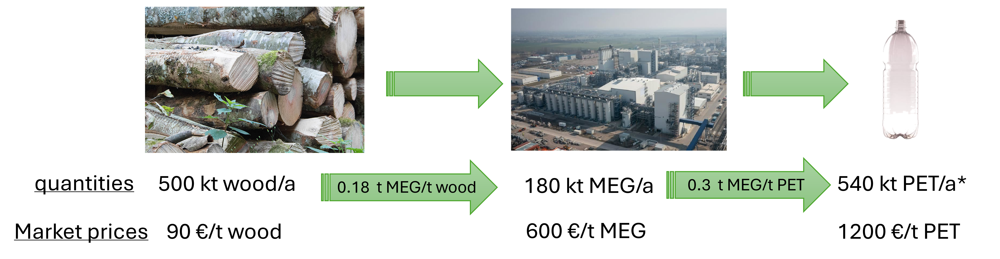
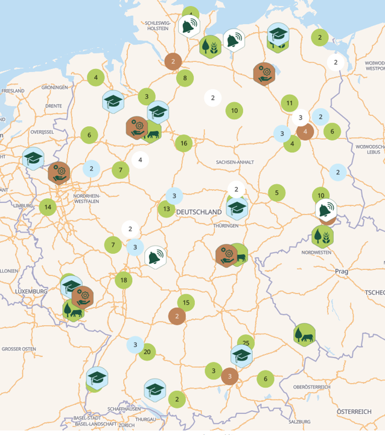

```{r setup-1, echo=FALSE, message=FALSE, warning=FALSE}

suppressPackageStartupMessages({
  
  library(leaflet)
  library(htmlwidgets)
  library(htmltools)
  library(magick)
  library(dplyr)
  library(plotly)
  library(ggplot2)
  library(tidyr)
  library(patchwork)
  library(knitr)
  library(kableExtra)
  library(sf)
  library(tibble)
  library(stringr)
  library(leaflet)
  library(osrm)
  library(ROI)
  library(ROI.plugin.glpk)
  library(gurobi)
  library(ROI.plugin.gurobi)
  library(ggrepel)
  library(ggnewscale)
  library(rnaturalearth)
  library(rnaturalearthdata)
  library(Rcpp)
  library(RcppArmadillo)
  library(scatterpie)
  library(networkD3)
  library(webshot2)
  library(ggalluvial)
  library(scales)
  library(purrr)
  library(broom)
  library(RefManageR)
  library(collapsibleTree)
  library(tikzDevice)
  library(pdftools)
})


BibOptions(
  check.entries = FALSE,
  bib.style     = "authoryear",
  cite.style    = "authoryear",
  style         = "markdown",
  hyperlink     = FALSE,
  dashed        = FALSE,
  max.names      = 2,
  longnamesfirst = FALSE
)
bib <- ReadBib("literature.bib", check = FALSE)
```

```{r setup-2, echo=FALSE, message=FALSE, warning=FALSE, cache=TRUE}
source("../../Modell/!afs_biomass_setup.r")
source("../../Modell/extract_result.R")
source("../../Modell/!helper_func.r")
source("../../Modell/!helper_instance_builder_v8a.R")
source("../../Modell/!build_AFS_milp.r")
#Rcpp::sourceCpp("../../Modell/build_and_solve_afs_lp_v11.cpp")

load("../../Paper/afs_workspace_red.RData")

sites_sf         <- afs_workspace$sites_sf
sites            <- afs_workspace$sites
sites_clustered  <- afs_workspace$sites_clustered
storages         <- afs_workspace$storages
consumers        <- afs_workspace$consumers

# Scale down industrial demand quantities
consumers <- consumers %>%
  mutate(demand_P1 = demand_P1 / 5)

# Drop small Biogas plants (total demand < 1.5 kt/yr)
consumers <- consumers %>%
  mutate(total_demand = demand_P1 + demand_P2 + demand_P3) %>%
  filter(total_demand >= 1.5) %>%
  select(-total_demand)

dist_jk <- afs_workspace$dist_jk[, consumers$consumer_id]

# Gompertz yield scenario: N=250 trees/ha, conservative site quality
yields_by_age <- build_scenario_ts(
  ages   = 1:20,
  N      = 250,
  C_site = 6.500,
  k      = 0.194,
  t0     = 9.7,
  label  = "Conservative (250 trees/ha)"
)

yields_by_age <- yields_by_age %>%
  select(-scenario) %>%
  pivot_longer(-1, names_to = "product", values_to = "yield_ha") %>%
  mutate(product = as.integer(as.character(factor(product, labels = c(2, 1, 3)))))

# Convert dry-matter yields to fresh-weight (moisture content omega = 0.50)
yields_by_age$yield_ha <- yields_by_age$yield_ha / (1 - 0.5)

set.seed(123578)
c.opp.vec <- rnorm(nrow(sites_clustered), 1, .75)

sites_clustered <- sites_clustered %>%
  mutate(
    C_est  = 2500,           # €/ha  establishment cost
    C_harv =  150,           # €/ha  harvest cost
    C_main =   10,           # €/ha  annual maintenance cost
    C_opp  = 150 * c.opp.vec # €/ha  annual opportunity cost
  )

storages$CAP_stor <- storages$CAP_stor * 100000
storages$CAP_proc <- storages$CAP_proc * 100000

data_obj <- list(
  sites         = sites_clustered,
  storages      = storages,
  consumers     = consumers,
  dist_ij       = afs_workspace$dist_ij_clust,
  dist_jk       = dist_jk,
  yields_by_age = yields_by_age
)

data_obj$consumers[, c("demand_P1", "demand_P2", "demand_P3")] <-
  data_obj$consumers[, c("demand_P1", "demand_P2", "demand_P3")] * 1000

params_obj <- list(
  n_periods = 40,
  max_age   = 15L,   # A_max: upper rotation bound
  min_age   =  3L,   # A_min: lower rotation bound
  c_tr_raw  = 0.08,  # €/(t·km) raw biomass site → storage
  c_tr_pre  = 0.06   # €/(t·km) chips      storage → consumer
)

milp_instance <- build_optimization_instance(
  data   = data_obj,
  params = params_obj
)

result        <- readRDS("../../Paper/result_lp_v11.rds")
ext           <- result$solution_vector

ext$Xjk <- ext$Xjk %>%
  rename(src_product = p, del_product = q, period = t, hub_id = j, consumer_id = k)
ext$Xij <- ext$Xij %>%
  rename(period = t, site_id = i, hub_id = j)
ext$z   <- ext$z %>%
  rename(arc_type = type, site_id = i)
ext$S   <- ext$S %>%
  rename(hub_id = j, period = t)

res.sens.list <- readRDS("../../Paper/res_sens_list_lp_v11.rds")

#  map data 


bbox_wgs84 <- st_as_sfc(
  st_bbox(c(xmin = 10.6, xmax = 13.2, ymin = 50.9, ymax = 52.8), crs = st_crs(4326))
)

de_states <- ne_states(country = "Germany", returnclass = "sf") %>%
  st_transform(4326) %>%
  st_intersection(bbox_wgs84)

rivers_eu <- ne_download(
  scale = 10, type = "rivers_lake_centerlines",
  category = "physical", returnclass = "sf"
) %>%
  st_transform(4326) %>%
  st_intersection(bbox_wgs84)

```

## Overview

1.  **Introduction**
2.  **AFS Systems, Value Creation & Biomass Growth**
3.  **MILP Model for AFS Supply Chain Design (AFS-SCD)**
4.  **Case Study: Saxony-Anhalt**
5.  **Conclusion & Outlook**

------------------------------------------------------------------------

# Introduction

------------------------------------------------------------------------

## What is the Bioeconomy?

> **"The bioeconomy encompasses the production of renewable biological resources and their conversion into food, feed, bio-based products, and bioenergy."** — European Commission, 2012; updated strategy 2018

- 🌾 **Biomass** as the primary feedstock (agriculture, forestry, marine)
- 🔬 **Biotechnology** enabling valorisation at molecular level
- ♻️ **Circular economy** integration — substitution of fossil feedstocks

| Indicator              | Value             |
|------------------------|-------------------|
| Gross value added      | € 2.7 trillion    |
| Employment             | 17.1 million jobs |
| Share of EU GDP        | \~11–16 %         |
| Share of EU employment | \~8 %             |

------------------------------------------------------------------------

## Growth Potentials: market segments — size & growth

| Segment                         | Market 2025   | CAGR to 2030/34 |
|---------------------------------|---------------|-----------------|
| Bio-based chemicals (global)    | \$ 110–120 bn | **9.6 %**       |
| Bio-based polymers (production) | 4.5 mio. t    | **11.0 %**      |
| Biorefineries (global)          | \$ 57–146 bn  | **7.8–9.6 %**   |
| Biofuels (global)               | \~\$ 145 bn   | **5.8 %**       |
| Bioplastics (global)            | \$ 11.9 bn    | **8.1 %**       |

📦 **Bio-based polymers** capacity target: 8.5 mio. t by 2030 Bio-PP: +94 % new capacity

🧪 **Platform chemicals** Succinic acid, lactic acid — CAGR 5.9 %; market \$ 28 bn by 2035

💊 **Biopharmaceuticals (DE)** € 19.2 bn revenue (2023); 34.5 % market share — fastest-growing pharma sub-sector

------------------------------------------------------------------------

## Biobased plastics

```{r, echo=FALSE, out.width="90%", fig.align="center"}

```

:::: {.callout-note icon="false" appearance="simple"}
::: {style="font-size: 1.5rem;"}
Total wood production in Germany: $\approx$ 27 mill. t dry wood (2024), of which $\approx$ 4–5 mill. t is beech `r Citep(bib, "StatistischesBundesamt2026_WoodProduction")`. UPM Biochemicals (Leuna) demands $\approx$ 10 % of German beech production for biochemical conversion `r Citep(bib, "upmBiochemicals2024")`.
:::
::::

------------------------------------------------------------------------

## Feedstocks – Trees in Agricultural Systems

::::: columns
::: {.column width="50%"}
**Short-Rotation Coppice (SRC)**

- Monoculture, 8,000–20,000 trees/ha
- Rotation: 3–7 years; lifetime: 20–25 years
- No inter-row crop production

{width="70%" fig-align="center"}
:::

::: {.column .fragment width="50%"}
**Agroforestry Systems (AFS)**

- 1–4 tree rows in alley-cropping
- 10–30 % of total parcel area → 400–800 trees/ha
- Edge-tree effect

{width="70%" fig-align="center"}
:::
:::::

------------------------------------------------------------------------

## AFS Potential in Germany

::::::: columns
::: {.column width="40%"}
<a href="https://defaf.map.agroforestry-map.eu/de" target="_blank" rel="noopener">

```{r}
#| echo: false
#| out-width: "95%"
#| fig-align: center

```

</a>
:::

::::: {.column width="60%"}
- In Germany, \~1,200 ha of silvoarable AFS established in 2025 (≈ 0.02 % of agricultural land) `r Citep(bib, "DEFAF")`
- Total agricultural land: \~17 mill. ha → potential AFS area: 1–2 mill. ha (6–12 %)
- Gross wood potential from AFS: 10–30 mill. t dry wood per year

:::: {.callout-note icon="false" appearance="simple"}
::: {style="font-size: 1.8rem;"}
**Research question:** How can AFS-based biomass supply chains be designed to make AFS economically attractive for farmers and industries?
:::
::::
:::::
:::::::

------------------------------------------------------------------------

# AFS Systems, Value Creation & Biomass Growth

------------------------------------------------------------------------

## Economics of Agroforestry Systems

:::::: columns
::: {.column width="40%"}
```{r}
#| label: afs-tree-interactive
#| echo: false
#| message: false
#| warning: false
#| out-width: "100%"

library(collapsibleTree)

economics <- data.frame(
  Level1 = c(rep("Costs", 5), rep("Returns", 4)),
  Level2 = c(
    "Establishment costs",
    "Maintenance costs",
    "Harvest costs (Arable Crops)",
    "Harvest costs (Timber)",
    "Opportunity costs (land foregone)",
    "Wood biomass revenues",
    "Arable Crop Yield",
    "Agricultural Subsidies & Direct Payments",
    "Carbon Credits & C-Markets"
  )
)

fill_colours <- c(
  "#2d6a2d",
  "#c0392b", "#27ae60",
  rep("#f1948a", 5),
  rep("#a9dfbf", 4)
)

collapsibleTree(
  economics,
  hierarchy = c("Level1", "Level2"),
  width     = 400,
  height    = 400,
  fontSize  = 18,
  nodeSize  = "leafCount",
  fill      = fill_colours,
  tooltip   = TRUE,
  collapsed = FALSE
)
```
:::

:::: {.column width="60%"}
::: {style="font-size: 1.3rem;"}
- **Costs:**
  - Establishment: 1,500–3,500 €/ha for planting, site prep `r Citep(bib, "Faasch2012_SRC_Economics")`
  - Maintenance: \~10 €/ha/yr (pruning, pest management)
  - Harvest: 200–400 €/ha `r Citep(bib, "Testa2014_Poplar_Economics")`
  - Opportunity: foregone crop revenues (400–600 €/ha/yr in fertile regions)
- **Returns:**
  - Wood & biomass revenues
  - Crop yield premium in inter-row strips (+5–15 % relative to open-field) `r Citep(bib, "Graves2007_Agroforestry_Economics")`
  - Subsidies and carbon credits `r Citep(bib, "Toensmeier2017_Carbon_Agroforestry")`
:::
::::
::::::

. . .

:::: {.callout-note icon="false" appearance="simple"}
::: {style="font-size: 1.8rem;"}
Profitability depends critically on which value chains absorb harvested biomass fractions.
:::
::::

------------------------------------------------------------------------

## Usage of AFS Biomasses

::::::: columns
::::: {.column width="34%"}
::: {.callout-note appearance="simple" icon="false"}
### Biomass fractions

- 🪵 **Stem wood**\
  Diameter: **\> 15 cm**

- 🌿 **Large branches**\
  Diameter: **7–15 cm**

- 🍃 **Small branches / leaves**\
  Diameter: **\< 7 cm**
:::

::: {.callout-tip appearance="simple" icon="false"}
### Cascade principle

**Stem → Branch → Residue**\
High-value material uses should be prioritised before energetic use; residual fractions can then be routed to heat, power, or biogas pathways.
:::
:::::

::: {.column width="66%"}
| Application | Main products | Suitable fractions |
|------------------------|------------------------|------------------------|
| 🪑 **Furniture industry** | Sawn timber, veneers | **Stem wood** |
| 📄 **Paper industry** | Pulp, fibres, cardboard | **Stem + large branches** |
| 🧪 **Chemical industry** | Bioplastics, lignin derivatives, resins | **Stem + large branches** |
| 🔥 **Energy generation** | Wood chips, pellets, CHP | **All fractions** |
| 🫧 **Biogas plant** | Anaerobic digestion, electricity + heat | **Leaves + fine brushwood** |
:::
:::::::

------------------------------------------------------------------------

## Modelling Biomass Growth – Gompertz Stand Model

:::::: columns
:::: {.column width="50%"}
::: {style="font-size: 0.9em;"}
**Stand-level Gompertz model:** $M(t) = A \cdot e^{-e^{-k \cdot (t - t_0) }}$

- $A$ — asymptotic biomass quantity\
- $t_0 \in [9, 10]$ – inflection point maximal growth rate\
- $k \in [0.17, 0.2]$ – shape/skewness of growth curve

**Compartment fractions** (logistic model)

$q_p(t) = \frac{f_p}{1 + \exp(-r_p \cdot (t - t_{50,p}))}$

Calibrated for stem ($d \geq 15$ cm) and branches ($d \geq 7$ cm) residue defined as rest `r Citep(bib, "Jha2018_Poplar_AFS_Biomass")`; `r Citep(bib, "Civitarese2019_Poplar_Harvest")`
:::
::::

::: {.column width="50%"}
```{r}
#| label: max3-growth
#| fig-width: 6
#| out-width: "90%"
#| cache: false

age.vec <- seq(0, 20, by = 0.1)

cons <- build_scenario_ts(
  ages  = age.vec,
  N     = 300,
  C_site = 6.500,
  k     = 0.194,
  t0    = 9.7,
  label = "Conservative (250 trees/ha)"
)

comp_long <- bind_rows(cons) |>
  rename(stem = "Merch. stem",
         branch = "Merch. branch",
         residue = Residue) |>
  tidyr::pivot_longer(
    c("stem", "branch", "residue"),
    names_to  = "component",
    values_to = "biomass"
  ) |>
  dplyr::mutate(component = factor(component,
                                   levels = c("residue", "branch", "stem"))) |>
  dplyr::select(-scenario)

emp_pts <- tibble::tribble(
  ~age, ~AGB,   ~p_stem, ~p_branch,
   8,   134.3,  0.747,   0.166,
   9,    74.0,  0.830,   0.110,
   9,    51.5,  0.920,   0.040,
  10,   119,    0.76,    0.210,
  13,   152.0,  0.770,   0.220
) |>
  dplyr::mutate(
    stem_cum   = AGB * p_stem,
    branch_cum = AGB * (p_stem + p_branch),
    total      = AGB
  )

emp_long <- dplyr::bind_rows(
  emp_pts |>
    dplyr::transmute(age, biomass = stem_cum,   series = "Empirical: stem"),
  emp_pts |>
    dplyr::transmute(age, biomass = branch_cum, series = "Empirical: stem+branches"),
  emp_pts |>
    dplyr::transmute(age, biomass = total,      series = "Empirical: total biomass")
) |>
  dplyr::mutate(series = factor(
    series,
    levels = c("Empirical: stem",
               "Empirical: stem+branches",
               "Empirical: total biomass")
  ))

emp_col <- c(
  "Empirical: stem"          = "darkgreen",
  "Empirical: stem+branches" = "darkorange",
  "Empirical: total biomass" = "navy"
)

emp_shape <- c(
  "Empirical: stem"          = 21L,
  "Empirical: stem+branches" = 24L,
  "Empirical: total biomass" = 23L
)

p <- ggplot(comp_long, aes(x = age, y = biomass)) +
  annotate("rect", xmin = 5, xmax = 15, ymin = 0, ymax = Inf,
           fill = "grey80", alpha = 0.25) +
  geom_area(aes(fill = component),
            position = "stack", alpha = 0.70,
            colour = "white", linewidth = 0.2) +
  geom_point(
    data = emp_long,
    aes(x = age, y = biomass, colour = series, shape = series, fill = series),
    size = 2.5, alpha = 0.90, inherit.aes = FALSE
  ) +
  scale_fill_manual(
    name   = "Biomass fraction",
    values = c("stem" = "#1b9e77",
               "branch" = "#d95f02",
               "residue" = "#7570b3"),
    breaks = c("stem", "branch", "residue")
  ) +
  scale_colour_manual(
    name   = "Empirical data",
    values = emp_col
  ) +
  scale_shape_manual(
    name   = "Empirical data",
    values = emp_shape
  ) +
  guides(
    fill = guide_legend(
      order = 1,
      override.aes = list(shape = NA, colour = NA, linetype = 0)
    ),
    colour = guide_legend(
      order = 3,
      override.aes = list(
        shape = emp_shape[levels(emp_long$series)],
        size  = 2.5,
        fill  = emp_col[levels(emp_long$series)]
      )
    ),
    shape = "none"
  ) +
  scale_x_continuous(breaks = seq(0, 20, 2)) +
  labs(
    x = "Stand age (years)",
    y = "Biomass (t DM/ha)",
    caption = "Grey band: typical medium-rotation harvest window (5–15 years)."
  ) +
  theme_minimal(base_size = 9) +
  theme(
    legend.position   = "top",
    legend.key.size   = unit(0.4, "cm"),
    legend.text       = element_text(size = 7),
    legend.title      = element_text(size = 8, face = "bold"),
    panel.grid.minor  = element_blank()
  )

ggplotly(p, height = 500)
```
:::
::::::

------------------------------------------------------------------------

# MILP Model for AFS Supply Chain Design (AFS-SCD)

------------------------------------------------------------------------

## Model Structure and Decisions

:::: {.callout-note icon="false" appearance="simple"}
::: {style="font-size: 1.8rem;"}
**Objective (AFS-SCD):** Maximise total supply chain profit over a planning horizon of $T$ years, integrating establishment, harvesting, logistics, and product cascading decisions.
:::
::::

:::::: columns
:::: {.column width="55%"}
::: {style="font-size: 0.9em;"}
**Sets & variables:**

- **Stage 1:** potential AFS sites $\mathcal{I}$
- **Stage 2:** Pre-treatment / storage nodes $\mathcal{J}$
- **Stage 3:** Industrial consumers $\mathcal{K}$
- $z_{ist}$ — area of site $i$ with AFS operated under arc $(s,t)$
- $X_{ijpt}$ / $X_{jkpp't}$ — biomass transport from site $i/j$ to $j/k$
- $S_{jpt}$ — end-of-period inventory at facility $j$
:::
::::

::: {.column width="45%"}
```{r, engine='tikz', fig.ext='png', fig.align='center', out.width='90%', echo=FALSE,  engine.opts=list(extra.preamble=c("\\usepackage{tikz}","\\usetikzlibrary{arrows.meta,shapes.geometric,shapes.misc}")),  fig.height = 3.5, cache=TRUE}
% --- Network A: Supply chain stages (I sites -> J hub -> K consumers)
\begin{tikzpicture}[x=1cm,y=1cm,>=latex]
  % Styles
  \tikzstyle{site}=[circle, draw=teal!70!black, fill=teal!18, thick, minimum size=8mm]
  \tikzstyle{hub}=[rectangle, rounded corners=2pt, draw=orange!80!black, fill=orange!20, thick, minimum width=12mm, minimum height=8mm]
  \tikzstyle{consumer}=[circle, draw=purple!70!black, fill=purple!18, thick, minimum size=8mm]
  \tikzstyle{flow}=[->, thick, draw=gray!75]

  % Column labels
  \node[align=center, font=\small\bfseries] at (0,4.2) {Sites\\$i \in I$};
  \node[align=center, font=\small\bfseries] at (4,4.2) {Hub\\$j \in J$};
  \node[align=center, font=\small\bfseries] at (8,4.2) {Consumers\\$k \in K$};

  % Sites
  \node[site] (i1) at (0,3) {$i_1$};
  \node[site] (i2) at (0,2) {$i_2$};
  \node[site] (i3) at (0,1) {$i_3$};

  % Hub
  \node[hub] (j1) at (4,2.5) {$j_1$};
  \node[hub] (j2) at (4,1.5) {$j_2$};

  % Consumers
  \node[consumer] (k1) at (8,3) {$k_1$};
  \node[consumer] (k2) at (8,2) {$k_2$};
  \node[consumer] (k3) at (8,1) {$k_3$};

  % Flows: sites to hub
  \draw[flow] (i1) -- node[above, sloped, font=\scriptsize] {$x_{i_1 j_1}$} (j1);
  \draw[flow] (i2) -- node[above, sloped, font=\scriptsize] {$x_{i_2 j_1}$} (j1);
  %\draw[flow] (i3) -- node[below, sloped, font=\scriptsize] {$x_{i_3 j_1}$} (j1);
% Flows: sites to hub
  %\draw[flow] (i1) -- node[above, sloped, font=\scriptsize] {$x_{i_1 j_1}$} (j2);
  \draw[flow] (i2) -- node[above, sloped, font=\scriptsize] {$x_{i_2 j_2}$} (j2);
  \draw[flow] (i3) -- node[below, sloped, font=\scriptsize] {$x_{i_3 j_2}$} (j2);


  % Flows: hub to consumers
  \draw[flow] (j1) -- node[above, sloped, font=\scriptsize] {$x_{j_1 k_1}$} (k1);
  \draw[flow] (j1) -- node[above, sloped, font=\scriptsize] {$x_{j_1 k_2}$} (k2);
%  \draw[flow] (j1) -- node[below, sloped, font=\scriptsize] {$x_{j_1 k_3}$} (k3);

  \draw[flow] (j2) -- node[above, sloped, font=\scriptsize] {$x_{j_2 k_1}$} (k2);
  \draw[flow] (j2) -- node[above, sloped, font=\scriptsize] {$x_{j_2 k_2}$} (k3);


  % Optional annotation
  %\node[align=center, font=\scriptsize, text=gray!70] at (4,-0.1)
  %{Two-stage transport structure: feedstock collection and downstream distribution};
\end{tikzpicture}
```

```{r, engine='tikz', fig.ext='png', fig.align='center', out.width='90%', echo=FALSE,  engine.opts=list(extra.preamble=c("\\usepackage{tikz}","\\usetikzlibrary{arrows.meta,shapes.geometric,shapes.misc}")),  fig.height = 3.5, cache=TRUE}

% --- Network B: Product cascade (stem -> branch -> residue)
\begin{tikzpicture}[x=1cm,y=1cm,>=latex]
  % Styles
  \tikzstyle{prodA}=[rectangle, rounded corners=2pt, draw=green!60!black, fill=green!20, thick, minimum width=18mm, minimum height=8mm]
  \tikzstyle{prodB}=[rectangle, rounded corners=2pt, draw=orange!80!black, fill=orange!20, thick, minimum width=18mm, minimum height=8mm]
  \tikzstyle{prodC}=[rectangle, rounded corners=2pt, draw=violet!70!black, fill=violet!18, thick, minimum width=18mm, minimum height=8mm]
  \tikzstyle{flow}=[->, thick, draw=gray!75]
  \tikzstyle{sideflow}=[->, dashed, thick, draw=gray!55]

  % Main cascade nodes
  \node[prodA] (stem) at (0,2) {Stem};
  \node[prodB] (branch) at (4,2) {Branch};
  \node[prodC] (residue) at (8,2) {Residue};

  % Main cascade arrows
  \draw[flow] (stem) -- node[above, font=\scriptsize] {downgrade} (branch);
  \draw[flow] (branch) -- node[above, font=\scriptsize] {downgrade} (residue);
  \draw[flow] (stem) to[out=45,  in=135,  looseness=0.55] (residue);
  % Optional side sinks / uses
  \node[font=\small\bfseries, align=center] (u1) at (0,0.4) {high-value\\chemical, timber};
  \node[font=\small\bfseries, align=center] (u2) at (4,0.4) {medium-value\\paper \& pulp};
  \node[font=\small\bfseries, align=center] (u3) at (8,0.4) {low-value\\ energy};

  \draw[sideflow] (stem) -- (u1);
  \draw[sideflow] (branch) -- (u2);
  \draw[sideflow] (residue) -- (u3);

  % Title-like label
  \node[align=center, font=\small\bfseries] at (4,3.75) {Biomass product cascade};
  \node[align=center, font=\scriptsize] at (4,3) {downgrade};
  % Optional note
  %\node[align=center, font=\scriptsize, text=gray!70] at (4,-0.6)
  %{Sequential use principle: material fractions move from higher to lower value applications};
\end{tikzpicture}
```
:::
::::::

------------------------------------------------------------------------

## Age-Lag Arc Structure for Harvest Scheduling

For planning horizon $T=8$, $A^{\min}=3$, $A^{\max}=5$:

```{r tikz-netzwerk-1, engine='tikz', fig.ext='png', fig.align='center', out.width='70%', echo=FALSE,  engine.opts=list(extra.preamble=c("\\usepackage{tikz}","\\usetikzlibrary{arrows.meta,shapes.geometric,shapes.misc}")),  fig.height = 2.5, cache=TRUE}

\begin{tikzpicture}[
  x=1.55cm, y=1cm,
  node/.style={circle, draw, fill=#1, text=white,
               font=\small\bfseries, inner sep=2pt, minimum size=18pt},
  est/.style  ={-{Stealth[length=4pt]}, blue!70!black,  dashed, semithick},
  harva/.style={-{Stealth[length=4pt]}, green!40!black, semithick},
  harvb/.style={-{Stealth[length=4pt]}, green!40!black, semithick},
  term/.style ={-{Stealth[length=4pt]}, red!70!black,   semithick},
]

\node[node=blue!70!black]  (n0) at (0,0) {$0$};
\foreach \i in {1,...,8} {
  \node[node=gray!50!black] (n\i) at (\i,0) {$\i$};
}
\node[node=red!70!black]   (n9) at (9,0) {$9$};

\draw[est] (n0) -- (n1);
\foreach \t/\l in {2/1.3, 3/1.0, 4/0.80, 5/0.65}{
  \draw[est] (n0) to[out=55, in=125, looseness=\l] (n\t);
}

\draw[harva] (n1) to[out=55,  in=125,  looseness=0.55] (n4);
\draw[harvb] (n2) to[out=-55, in=-125, looseness=0.55] (n5);
\draw[harva] (n3) to[out=55,  in=125,  looseness=0.55] (n6);
\draw[harvb] (n4) to[out=-55, in=-125, looseness=0.55] (n7);
\draw[harva] (n5) to[out=55,  in=125,  looseness=0.55] (n8);
\draw[harva] (n1) to[out=60,  in=120,  looseness=0.42] (n5);
\draw[harvb] (n2) to[out=-60, in=-120, looseness=0.42] (n6);
\draw[harva] (n3) to[out=60,  in=120,  looseness=0.42] (n7);
\draw[harvb] (n4) to[out=-60, in=-120, looseness=0.42] (n8);
\draw[harva] (n1) to[out=65,  in=115,  looseness=0.35] (n6);
\draw[harvb] (n2) to[out=-65, in=-115, looseness=0.35] (n7);
\draw[harva] (n3) to[out=65,  in=115,  looseness=0.35] (n8);

\foreach \s/\l in {4/0.80, 5/0.65, 6/0.55, 7/0.48}{
  \draw[term] (n\s) to[out=55, in=125, looseness=\l] (n9);
}
\draw[term] (n8) -- (n9);

\node[anchor=north west] at (0.0,2.5) {%
  \begin{tikzpicture}[x=0.6cm,y=0.35cm,baseline=0pt]
    \draw[est]   (0,0)--(1,0);
    \node[font=\small, anchor=west] at (1.1,0) {Establishment arc $(0,t)$};
  \end{tikzpicture}};
\node[anchor=north west] at (3.5,2.5) {%
  \begin{tikzpicture}[x=0.6cm,y=0.35cm,baseline=0pt]
    \draw[harva] (0,0)--(1,0);
    \node[font=\small, anchor=west] at (1.1,0) {Harvest arc $(s,t)$};
  \end{tikzpicture}};
\node[anchor=north west] at (6.3,2.5) {%
  \begin{tikzpicture}[x=0.6cm,y=0.35cm,baseline=0pt]
    \draw[term]  (0,0)--(1,0);
    \node[font=\small, anchor=west] at (1.1,0) {Termination arc $(s,9)$};
  \end{tikzpicture}};

\end{tikzpicture}
```

. . .

**Example path**: establishment in $t=1$, harvests in $t=5$ and $t=8$

```{r tikz-netzwerk-2, engine='tikz', fig.ext='png', fig.align='center', out.width='70%', echo=FALSE,  engine.opts=list(extra.preamble=c("\\usepackage{tikz}","\\usetikzlibrary{arrows.meta,shapes.geometric,shapes.misc}")),  fig.height = 2.5, cache=TRUE}

\begin{tikzpicture}[
  x=1.55cm, y=1cm,
  node/.style    ={circle, draw, fill=#1, text=white,
                   font=\small\bfseries, inner sep=2pt, minimum size=18pt},
  inactive/.style={node=gray!25, text=gray!50},
  pathnode/.style={node=green!40!black},
  n0style/.style ={node=blue!70!black},
  n9style/.style ={node=red!70!black},
  patharc/.style ={-{Stealth[length=5pt]}, green!40!black, very thick},
  est/.style     ={patharc, blue!70!black, dashed},
  term/.style    ={patharc, red!70!black},
]

\node[n0style]   (n0) at (0,0) {$0$};
\foreach \i in {2,3,4,6,7} {
  \node[inactive] (n\i) at (\i,0) {$\i$};
}
\foreach \i in {1,5,8} {
  \node[pathnode]  (n\i) at (\i,0) {$\i$};
}
\node[n9style]   (n9) at (9,0) {$9$};

\draw[est]     (n0) -- (n1);
\draw[patharc] (n1) to[out=60, in=120, looseness=0.42] (n5);
\draw[term] (n5) to[out=-50, in=-130, looseness=0.42] (n9);
\draw[patharc] (n5) to[out=55, in=125, looseness=0.55] (n8);
\draw[term]    (n8) -- (n9);

\node[font=\footnotesize, text=blue!70!black]   at (0.5, 0.28) {est.};
\node[font=\footnotesize, text=blue!70!black]   at (0.5, -0.3) {$100$};
\node[font=\footnotesize, text=green!40!black]  at (3.0, 1.1)  {$100$};
\node[font=\footnotesize, text=green!40!black]  at (3.0, 0.6)  {$t-s=4$};
\node[font=\footnotesize, text=green!40!black]  at (6.5, 1) {$70$};
\node[font=\footnotesize, text=red!70!black]  at (7, -1.0) {$30$};
\node[font=\footnotesize, text=red!70!black]  at (8.5, -0.3) {$70$};
\node[font=\footnotesize, text=green!40!black]  at (6.5, 0.55) {$t-s=3$};
\node[font=\footnotesize, text=red!70!black]    at (8.5, 0.28) {term.};

\end{tikzpicture}
```

------------------------------------------------------------------------

## Objective Function (AFS-SCD)

::: {style="font-size: 0.75em;"}
$$\begin{aligned}
\max\; Z \;=\;&
  \sum_{k,\,p} R_{kp} \cdot\sum_{j,\,(p',p),\, t} X_{jkp'pt}  &\text{Revenue}  \\
&- \sum_{i} c^{\text{est}}_i \cdot\sum_{(0,t)\in\mathcal{S}^{est}} z_{i0t} &\text{Establishment cost}\\
&- \sum_{i} (c^{\text{main}}_i + c^{\text{opp}}_i) \cdot (t-s) \cdot \sum_{(s,t)\in\mathcal{S}^{harv}} z_{ist} &\text{Maintenance + Opportunity cost}\\
&- \sum_{i} c^{\text{harv}}_i \cdot \sum_{(s,t)\in\mathcal{S}^{harv}} z_{ist} &\text{Harvest cost}\\
&- \sum_{i,\,j,\,p,\,t} c^{\text{tr-raw}}_p \cdot d_{ij} \cdot X_{ijpt} &\text{Raw transport cost}\\
&- \sum_{j,\,k,\,(p,p'),\,t} c^{\text{tr-pre}}_{p'} \cdot d_{jk} \cdot X_{jkpp't} &\text{Pre-processed transport cost}\\
&- \sum_{j,\,p,\,t}  c^{\text{stor}}_j \cdot S_{jpt} &\text{Storage cost}
\end{aligned}$$
:::

:::: {.callout-note icon="false" appearance="simple"}
::: {style="font-size: 1.8rem;"}
$c^{\text{opp}}_i$ can be negative (subsidies / positive crop-yield spillovers) or positive (high-value arable land). Opportunity costs and transport costs are the two largest cost drivers `r Citep(bib, "Faasch2012_SRC_Economics")`.\]
:::
::::

------------------------------------------------------------------------

## Some constraints {.tight-lines}

::: {style="font-size: 0.75em;"}
**Establishment per site:** $$\sum_{(0,t)\in\mathcal{S}^{est}} z_{i0t} \leq \text{AREA}_i \qquad \forall\; i$$

**Flow conservation (path connectivity):** $$\sum_{(s,t)\in\mathcal{S}} z_{ist} = \sum_{(t,u)\in\mathcal{S}} z_{itu} \qquad \forall\; i,\; t$$

**Age-dependent biomass yield:** $$\sum_{j} X_{ijpt} \leq \sum_{(s,t)\in\mathcal{S}^{harv}} \eta_{p(t-s)} \cdot z_{ist} \qquad \forall\; i,p,t$$

where $\eta_{pa} = q_p(a) \cdot M(a)$ links Gompertz stand model to logistics flows.

**Quality cascade demand:** $$\sum_{j,\,(p',p)\in\mathcal{Q}} X_{jkp'pt} \leq D^{\max}_{kpt} \qquad \forall\; k,p,t$$

Higher-quality fractions (stems) can substitute lower-quality demands, not vice versa.
:::

------------------------------------------------------------------------

# Case Study: Saxony-Anhalt

------------------------------------------------------------------------

## Study Region & Supply Chain Configuration

- **Region:** Tri-state area of Saxony-Anhalt, northern Thuringia, northern Saxony (Germany)
- Highest density of registered SRC *Feldblöcke* in eastern Germany
- Road distances: 10–180 km between AFS sites and consumer locations
- OSRM routing for realistic transport cost estimates

. . .

:::::: columns
:::: {.column width="45%"}
::: columns
**Sites** $\mathcal{I}$

- Registered SRC parcels from InVeKoS land-use register
- Spatially clustered via DBSCAN + Ward.D2 HAC (max radius 15 km)
:::
::::

::: {.column .fragment width="55%"}
**Consumers** $\mathcal{K}$:

| Grade      | Consumers                 | Prices     |
|------------|---------------------------|------------|
| 1 Chemical | Mercer Stendal, UPM Leuna | 80–120 €/t |
| 2 Pulp     | 6 smaller facilities      | 55–75 €/t  |
| 3 Energy   | Residual absorbers        | 30–40 €/t  |
:::
::::::

------------------------------------------------------------------------

## Case Study Data Overview

:::::: columns
::: {.column width="50%"}
```{r}
#| label: fig-supply-chain-network-leaflet
#| fig-width: 6
#| out-width: "99%"
#| cache: false
#| echo: false

COLSAW  <- "#e65c00"
COLHUB  <- "#c05000"
COLP1   <- "#6a0dad"
COLP2   <- "#08519c"
COLP3   <- "#a50026"

cluster_assig <- afs_workspace$site_cluster_assig %>%
  select(site_id, hac_cluster) %>%
  mutate(hac_cluster = as.factor(hac_cluster))

sites_sf_clust <- sites_sf %>%
  mutate(site_id = seq_len(nrow(sites_sf))) %>%
  left_join(cluster_assig, by = "site_id") %>%
  st_transform(4326)

tmp_opp <- sites_clustered %>%
  select(site_id, C_opp) %>%
  rename(hac_cluster = site_id) %>%
  mutate(hac_cluster = as.factor(hac_cluster))

sites_sf_clust <- sites_sf_clust %>%
  left_join(tmp_opp, by = "hac_cluster") %>%
  st_intersection(bbox_wgs84)

consumers_plt <- consumers %>%
  mutate(
    total_demand = demand_P1 + demand_P2 + demand_P3,
    kategorie = case_when(
      demand_P1 >= demand_P2 & demand_P1 >= demand_P3 & demand_P1 > 0 ~ "Chemical / Pulp (P1)",
      demand_P2 >= demand_P1 & demand_P2 >= demand_P3 & demand_P2 > 0 ~ "Pulp / Paper (P2)",
      demand_P3 > 0 ~ "Energy / Biogas (P3)",
      TRUE ~ "Other"
    ),
    ptsize = pmin(14, pmax(5, 5 + log1p(total_demand) / 1.8))
  )

storages_plt <- storages %>%
  mutate(subtype = "Hub", ptsize = 8)

storsf <- st_as_sf(storages_plt, coords = c("lng", "lat"), crs = 4326) %>%
  st_intersection(bbox_wgs84)

conssf <- st_as_sf(consumers_plt, coords = c("lng", "lat"), crs = 4326) %>%
  st_intersection(bbox_wgs84)

pal_opp <- colorNumeric(
  palette = c("#1a9641", "#ffffbf", "#d7191c"),
  domain = sites_sf_clust$C_opp,
  na.color = "transparent"
)

pal_cons <- colorFactor(
  palette = c(
    "Chemical / Pulp (P1)" = COLP1,
    "Pulp / Paper (P2)"    = COLP2,
    "Energy / Biogas (P3)" = COLP3,
    "Other"                = "grey60"
  ),
  domain = conssf$kategorie
)

map_sc <- leaflet(
  options = leafletOptions(zoomControl = TRUE, preferCanvas = FALSE),
  width = "100%",
  height = 500,
  elementId = "leaflet-map-supply-chain-1"
) %>%
  addProviderTiles(providers$CartoDB.Positron, group = "Basemap") %>%
  addPolylines(
     data = de_states,
     color = "grey55", weight = 1.5,
     group = "States"
   ) %>%
  addPolylines(
    data = rivers_eu,
    color = "#4292c6", weight = 1, opacity = 0.7,
    group = "Rivers"
  ) %>%
  addPolygons(
    data = sites_sf_clust,
    stroke = TRUE, color = "grey30", weight = 0.5,
    fillColor = ~pal_opp(C_opp), fillOpacity = 0.85,
    popup = ~paste0(
      "<strong>Site ID</strong>: ", site_id,
      "<br><strong>Cluster</strong>: ", hac_cluster,
      "<br><strong>Opp. cost</strong>: ", round(C_opp, 1), " €/ha"
    ),
    group = "AFS sites"
  ) %>%
  addCircleMarkers(
    data = storsf,
    radius = ~ptsize,
    color = COLHUB, stroke = TRUE, weight = 2,
    fillColor = COLHUB, fillOpacity = 0.95,
    popup = ~paste0("<strong>Hub</strong>"),
    group = "Hubs"
  ) %>%
  addCircleMarkers(
    data = conssf,
    radius = ~ptsize,
    color = "white", weight = 1,
    fillColor = ~pal_cons(kategorie), fillOpacity = 0.9,
    popup = ~paste0(
      "<strong>Consumer type</strong>: ", kategorie,
      "<br><strong>Total demand</strong>: ", round(total_demand, 1), " t"
    ),
    group = "Consumers"
  ) %>%
  addLegend(
    position = "bottomright",
    pal = pal_opp,
    values = sites_sf_clust$C_opp,
    title = "Opp. cost €/ha",
    opacity = 0.8
  ) %>%
  addLegend(
    position = "topright",
    pal = pal_cons,
    values = conssf$kategorie,
    title = "Consumer type",
    opacity = 0.95
  ) %>%
  addLayersControl(
    overlayGroups = c("AFS sites", "Hubs", "Consumers"),
    options = layersControlOptions(collapsed = FALSE)
  ) %>%
  fitBounds(lng1 = 10.6, lat1 = 50.9, lng2 = 13.2, lat2 = 52.8) %>%
  htmlwidgets::onRender("
    function(el, x) {
      var map = this;
      function fix() {
        map.invalidateSize({animate: false, pan: false});
      }
      // Sofort + verzögert nach initialem Render
      setTimeout(fix, 100);
      setTimeout(fix, 500);
      setTimeout(fix, 1500);
      // Bei jedem Folienwechsel (Reveal.js)
      document.addEventListener('slidechanged', function() {
        setTimeout(fix, 150);
        setTimeout(fix, 600);
      });
      // Reveal.js ready-Event
      if (typeof Reveal !== 'undefined') {
        Reveal.on('ready', function() { setTimeout(fix, 300); });
        Reveal.on('slidechanged', function() { setTimeout(fix, 150); });
      }
      // Fallback: ResizeObserver auf den Container
      if (typeof ResizeObserver !== 'undefined') {
        new ResizeObserver(function() {
          if (el.offsetWidth > 0) fix();
        }).observe(el);
      }
    }
  ")

map_sc
```
:::

:::: {.column width="50%"}
::: {style="font-size: 0.85em;"}
| Parameter | Value |
|------------------------------------|------------------------------------|
| Farms $\vert\mathcal{I}\vert$ | `r milp_instance$n_sites` (from `r nrow(afs_workspace$sites)` parcels) |
| Hubs $\vert\mathcal{J}\vert$ | `r milp_instance$n_storages` |
| Consumers $\vert\mathcal{K}\vert$ | `r milp_instance$n_consumers` |
| Planning horizon $T$ | 40 periods |
| Max rotation age $A_{\max}$ | 15 years |
| Min rotation age $A_{\min}$ | 3 years |
| Raw transport $c^{tr\text{-}raw}$ | 0.08 €/(t·km) |
| Pre-treated transport $c^{tr\text{-}pre}$ | 0.06 €/(t·km) |
| Establishment cost $c^{est}$ | 2,500 €/ha |
| Harvest cost $c^{harv}$ | 150 €/ha |
| Mean opportunity cost $c^{opp}$ | `r round(mean(milp_instance$sites$C_opp), 0)` €/ha/yr |
:::
::::
::::::

------------------------------------------------------------------------

# Optimisation Results

------------------------------------------------------------------------

## Establishment Decisions & Product Mix

:::::: columns
::: {.column width="65%"}
```{r}
#| label: fig-results-sc-map
#| fig-width: 6
#| out-width: 99%
#| cache: false
#| echo: false

crs_map <- 25833
COL_SAW <- "#e65c00"; COL_HUB <- "#c05000"
COL_P1 <- "#6a0dad"; COL_P2 <- "#08519c"; COL_P3 <- "#a50026"
COL_SITE_ACT <- "#1b9e77"; COL_SITE_NONE <- "#bdbdbd"
pal_products <- c(p1 = "#1b9e77", p2 = "#d95f02", p3 = "#7570b3")

bbox_wgs84 <- st_as_sfc(
  st_bbox(c(xmin = 10.6, xmax = 13.2, ymin = 50.9, ymax = 52.8), crs = st_crs(4326))
)
bbox_map <- st_transform(bbox_wgs84, crs_map)
bbox_num <- st_bbox(bbox_map)

de_states <- ne_states(country = "Germany", returnclass = "sf") %>%
  st_transform(crs_map) %>% st_intersection(bbox_map)
rivers_eu <- ne_download(scale = 10, type = "rivers_lake_centerlines",
                         category = "physical", returnclass = "sf") %>%
  st_transform(crs_map) %>% st_intersection(bbox_map)

site_harvest <- ext$Xij %>%
  group_by(site_id, p) %>%
  summarise(vol = sum(value, na.rm = TRUE), .groups = "drop") %>%
  tidyr::pivot_wider(names_from = p, values_from = vol, values_fill = 0, names_prefix = "p")
for (col in c("p1", "p2", "p3")) if (!col %in% names(site_harvest)) site_harvest[[col]] <- 0
site_harvest <- site_harvest %>% mutate(total_vol = p1 + p2 + p3) %>% filter(total_vol > 0)
active_site_ids <- unique(site_harvest$site_id)

sites_sf_map <- sites_sf %>%
  mutate(site_id = seq_len(nrow(sites_sf))) %>%
  inner_join(afs_workspace$site_cluster_assig, "site_id") %>%
  st_transform(crs_map) %>%
  mutate(active = hac_cluster %in% active_site_ids,
         site_class = if_else(active, "Active site", "Inactive site"))

tmp.opp <- sites_clustered %>% select(site_id, C_opp) %>% rename(hac_cluster = site_id)
sites_sf_map <- sites_sf_map %>% left_join(tmp.opp, by = "hac_cluster")
sites_inactive <- sites_sf_map %>% filter(!active)
sites_active   <- sites_sf_map %>% filter(active)

sites_pie_sf <- milp_instance$sites %>%
  inner_join(site_harvest, by = "site_id") %>%
  st_as_sf(coords = c("lng", "lat"), crs = 4326) %>% st_transform(crs_map)
coords_sites <- st_coordinates(sites_pie_sf)
sites_pie <- sites_pie_sf %>% st_drop_geometry() %>%
  mutate(x = coords_sites[, 1], y = coords_sites[, 2])
vol_med <- median(sites_pie$total_vol[sites_pie$total_vol > 0], na.rm = TRUE)
if (is.na(vol_med) || vol_med <= 0) vol_med <- 1
sites_pie <- sites_pie %>% mutate(r = 3500 * sqrt(total_vol / vol_med))

consumers_plt <- consumers %>%
  mutate(total_demand = demand_P1 + demand_P2 + demand_P3,
         kategorie = case_when(
           demand_P1 >= demand_P2 & demand_P1 >= demand_P3 & demand_P1 > 0 ~ "Chemical / Pulp (P1)",
           demand_P2 >= demand_P1 & demand_P2 >= demand_P3 & demand_P2 > 0 ~ "Pulp / Paper (P2)",
           demand_P3 > 0 ~ "Energy / Biogas (P3)", TRUE ~ "Other"),
         pt_size = pmin(4.5, pmax(1.5, 1.5 + log1p(total_demand) * 0.55)))
storages_plt <- storages %>%
  mutate(subtype = if_else(type == "Hub", "Logistics Hub", "Sawmill"),
         pt_size = pmin(3.5, pmax(1.2, 1.2 + log1p(CAP_proc) * 0.38)))
stor_sf <- st_as_sf(storages_plt, coords = c("lng", "lat"), crs = 4326) %>% st_transform(crs_map)
cons_sf <- st_as_sf(consumers_plt, coords = c("lng", "lat"), crs = 4326) %>% st_transform(crs_map)

ggplot() +
  geom_sf(data = de_states, fill = "grey96", colour = "grey55", linewidth = 0.35) +
  geom_sf(data = rivers_eu, colour = "#4292c6", linewidth = 0.35, alpha = 0.7) +
  geom_sf(data = sites_inactive, fill = COL_SITE_NONE, colour = NA, alpha = 0.55, show.legend = FALSE) +
  geom_sf(data = sites_active, aes(fill = C_opp), colour = NA, alpha = 0.75, show.legend = TRUE) +
  scale_fill_gradient2(
    name = "Opp. cost (€/ha)", low = "#1a9641", mid = "#ffffbf", high = "#d7191c",
    midpoint = 0, na.value = COL_SITE_NONE,
    guide = guide_colourbar(barwidth = 0.5, barheight = 3, title.position = "top")
  ) +
  ggnewscale::new_scale_colour() +
  ggnewscale::new_scale("shape") +
  geom_sf(data = stor_sf, aes(colour = subtype, shape = subtype, size = pt_size),
          stroke = 1.0, alpha = 0.92, show.legend = TRUE) +
  scale_colour_manual(name = "Pre-treatment", values = c("Sawmill" = COL_SAW, "Logistics Hub" = COL_HUB)) +
  scale_shape_manual(name = "Pre-treatment",  values = c("Sawmill" = 16, "Logistics Hub" = 17)) +
  ggnewscale::new_scale_fill() +
  geom_sf(data = cons_sf, aes(fill = kategorie, size = pt_size),
          shape = 22, colour = "white", stroke = 0.45, alpha = 0.9, show.legend = TRUE) +
  scale_fill_manual(name = "Consumer type",
    values = c("Chemical / Pulp (P1)" = COL_P1, "Pulp / Paper (P2)" = COL_P2,
               "Energy / Biogas (P3)" = COL_P3, "Other" = "grey60")) +
  ggnewscale::new_scale_fill() +
  scatterpie::geom_scatterpie(
    data = sites_pie, aes(x = x, y = y, r = r),
    cols = c("p1", "p2", "p3"), colour = "white", linewidth = 0.15,
    donut_radius = .5, alpha = 0.7, show.legend = TRUE) +
  scale_fill_manual(name = "Harvested biomass", values = pal_products,
                    labels = c(p1 = "Stem", p2 = "Branches", p3 = "Residues")) +
  scale_size_continuous(range = c(1.5, 5), guide = "none") +
  coord_sf(xlim = c(bbox_num["xmin"], bbox_num["xmax"]),
           ylim = c(bbox_num["ymin"], bbox_num["ymax"]), expand = FALSE) +
  labs(x = NULL, y = NULL) +
  theme_minimal(base_size = 9) +
  theme(panel.grid = element_line(colour = "grey88", linewidth = 0.25),
        legend.position = "right", legend.key.size = unit(0.40, "cm"),
        legend.text = element_text(size = 6), legend.title = element_text(size = 7.5, face = "bold"),
        axis.text = element_text(size = 7))
```
:::

:::: {.column width="35%"}
::: {style="font-size: 1em;"}
**Summary statistics:**

- **Total profit:** `r round(result$objective_value/10^6, 0)` Mill. €
- **Yearly Profit:** `r round(result$objective_value/10^6/milp_instance$n_periods, 1)` Mill. €
- **Active super-sites:** `r length(unique(ext$z$site_id))`/`r milp_instance$n_sites`
- **Biomass produced:** `r round(sum(ext$Xij$value)/1000000, 0)` Mt
- Sites with $C_{\text{opp}} > 150$ €/ha/yr are not selected
:::
::::
::::::

------------------------------------------------------------------------

## Product Flows by Biomass Fraction and End Use

```{r fig-results-harvest-gantt, echo=FALSE, message=FALSE, warning=FALSE, fig.width=8, fig.height=4, out.width="90%", cache=TRUE}

SRC_LABEL <- c("1" = "Stems", "2" = "Branches", "3" = "Residues")
DEL_LABEL <- c("1" = "Industrial", "2" = "Pulp & Paper", "3" = "Energy")
P_COLS_SRC <- c("Stems" = "#1b9e77", "Branches" = "#d95f02", "Residues" = "#7570b3")

flow_df <- ext$Xjk %>%
  group_by(src_product, del_product) %>%
  summarise(volume = sum(value, na.rm = TRUE), .groups = "drop") %>%
  filter(volume > 0) %>%
  mutate(
    src = factor(SRC_LABEL[as.character(src_product)], levels = SRC_LABEL),
    del = factor(DEL_LABEL[as.character(del_product)], levels = DEL_LABEL)
  )

ggplot(flow_df, aes(axis1 = src, axis2 = del, y = volume, fill = src)) +
  geom_alluvium(alpha = 0.72, width = 1/3, knot.pos = 0.45, curve_type = "sigmoid") +
  geom_stratum(width = 1/3, fill = "grey94", colour = "grey50", linewidth = 0.3) +
  geom_text(stat = "stratum", aes(label = after_stat(stratum)),
            size = 2.8, colour = "grey15", lineheight = 0.88) +
  annotate("text", x = c(1, 2), y = -Inf,
           label = c("Feedstock", "End use"), vjust = 1.6, size = 3.0,
           fontface = "bold", colour = "grey30") +
  scale_fill_manual(name = "Biomass fraction", values = P_COLS_SRC) +
  scale_x_discrete(expand = expansion(add = c(0.25, 0.25))) +
  scale_y_continuous(name = "Volume (t dry matter)",
                     labels = comma_format(big.mark = ".", decimal.mark = ",")) +
  coord_cartesian(clip = "off") +
  theme_minimal(base_size = 9) +
  theme(axis.title.x = element_blank(), axis.text.x = element_blank(),
        axis.ticks.x = element_blank(), panel.grid.major.x = element_blank(),
        panel.grid.minor = element_blank(), legend.position = "none",
        plot.margin = margin(t = 6, r = 6, b = 28, l = 6))
```

------------------------------------------------------------------------

## Harvesting Cycle Distribution

```{r fig-results-harvest-cycle-dist, echo=FALSE, message=FALSE, warning=FALSE, fig.width=7, fig.height=3.5, out.width="90%", cache=TRUE}

cycle_df <- ext$z %>%
  filter(arc_type == "harvest") %>%
  mutate(cycle_length = t - s)

mean_cl  <- mean(cycle_df$cycle_length)
med_cl   <- median(cycle_df$cycle_length)
n_events <- nrow(cycle_df)
n_sites  <- length(unique(cycle_df$site_id))

ggplot(cycle_df, aes(x = cycle_length)) +
  geom_bar(fill = "#1b9e77", colour = "white", linewidth = 0.25, width = 0.75) +
  geom_vline(xintercept = mean_cl, linetype = "dashed", colour = "grey30", linewidth = 0.6) +
  annotate("text", x = mean_cl + 0.25, y = Inf,
           label = paste0("Mean = ", round(mean_cl, 1), " yr"),
           hjust = 0, vjust = 1.5, size = 2.8, colour = "grey20") +
  scale_x_continuous(name = "Harvesting cycle length (years)",
                     breaks = seq(params_obj$min_age, params_obj$max_age, by = 1),
                     limits = c(params_obj$min_age - 0.5, params_obj$max_age + 0.5)) +
  scale_y_continuous(name = "Number of harvest events",
                     expand = expansion(mult = c(0, 0.12))) +
  labs(caption = paste0(n_events, " harvest events across ", n_sites,
                        " active sites; median = ", med_cl, " yr")) +
  theme_minimal(base_size = 9) +
  theme(panel.grid.major.x = element_blank(), panel.grid.minor = element_blank(),
        plot.caption = element_text(size = 7, colour = "grey40", hjust = 0))
```

Majority of harvests at ages 4–10 years (trade-off: yield growth vs. opportunity cost). Secondary peak at 12–15 years for sites near P1 consumers with low opportunity costs.

------------------------------------------------------------------------

## Biomass Volumes over Planning Horizon

```{r fig-results-product-mix, echo=FALSE, message=FALSE, warning=FALSE, fig.width=8, fig.height=4, out.width="90%", cache=TRUE}

prod_labels <- c("1" = "Stem (P1)", "2" = "Branches (P2)", "3" = "Residues (P3)")

delivery_ts <- ext$Xjk %>%
  group_by(period, product = factor(del_product)) %>%
  summarise(volume = sum(value), .groups = "drop")

shipped_ts <- ext$Xij %>%
  group_by(period) %>%
  summarise(shipped = sum(value), .groups = "drop")

ggplot(delivery_ts, aes(x = period, y = volume, fill = product)) +
  geom_area(position = "stack", alpha = 0.80, colour = "white", linewidth = 0.2) +
  geom_line(data = shipped_ts, aes(x = period, y = shipped),
            inherit.aes = FALSE, colour = "#636363", linetype = "dashed", linewidth = 0.7) +
  scale_fill_manual(name = "Product",
                    values = c("1" = "#1b9e77", "2" = "#d95f02", "3" = "#7570b3"),
                    labels = prod_labels) +
  scale_x_continuous(name = "Planning period (year)",
                     breaks = seq(1, milp_instance$n_periods, by = 2)) +
  scale_y_continuous(name = "Volume (t dry matter)", labels = scales::comma) +
  annotate("text", x = max(shipped_ts$period) - 1, y = max(shipped_ts$shipped) * 0.95,
           label = "Raw shipped\n(site→hub)", size = 2.5, colour = "#636363", hjust = 1) +
  theme_minimal(base_size = 9) +
  theme(legend.position = "right", panel.grid.minor = element_blank())
```

Throughput rises as newly established sites reach minimum harvest age, then stabilises. Stem biomass (P1) dominates early periods when merchantable stem fraction is highest.

------------------------------------------------------------------------

## Profit breakdown

```{r}
#| label: fig-results-cost-profit-breakdown
#| fig-width: 12
#| fig-height: 6
#| out-width: 99%
#| cache: false
#| echo: false

# ── 0. Colour palette (consistent with paper) ──────────────────────────────
COL_REV   <- "#1b9e77"   # revenue: green
COL_EST   <- "#d95f02"   # establishment
COL_HARV  <- "#7570b3"   # harvesting
COL_MAIN  <- "#e7298a"   # maintenance
COL_OPP   <- "#66a61e"   # opportunity
COL_TR_R  <- "#e6ab02"   # transport raw
COL_TR_P  <- "#a6761d"   # transport pre-processed
COL_STOR  <- "#666666"   # storage

col_map <- c(
  "Revenue"               = COL_REV,
  "Establishment"         = COL_EST,
  "Harvesting"            = COL_HARV,
  "Maintenance"           = COL_MAIN,
  "Opportunity"           = COL_OPP,
  "Transport (raw)"       = COL_TR_R,
  "Transport (pre-proc.)" = COL_TR_P,
  "Storage"               = COL_STOR
)

# ── 1. Site meta: area_ha and cost parameters for active sites only ─────────
active_site_ids <- ext$z %>%
  filter(arc_type == "harvest") %>%
  pull(site_id) %>% unique()

site_meta <- milp_instance$sites %>%
  mutate(site_id = row_number()) %>%
  filter(site_id %in% active_site_ids)

# ── 2. Cultivation costs (derived from arc decisions in ext$z) ──────────────
cost_est <- ext$z %>%
  filter(arc_type == "establishment") %>%
  #select(-area_ha) %>%
  left_join(site_meta, by = "site_id") %>%
  mutate(cost = C_est * value, period = t) %>%
  group_by(period) %>%
  summarise(cost = sum(cost, na.rm = TRUE), .groups = "drop") %>%
  mutate(component = "Establishment")

cost_harv <- ext$z %>%
  filter(arc_type == "harvest") %>%
  #select(-area_ha) %>%
  left_join(site_meta, by = "site_id") %>%
  mutate(cost = C_harv * value, period = t) %>%
  group_by(period) %>%
  summarise(cost = sum(cost, na.rm = TRUE), .groups = "drop") %>%
  mutate(component = "Harvesting")

cost_main <- ext$z %>%
  filter(arc_type == "harvest") %>%
  #select(-area_ha) %>%
  mutate(age_len = t-s) %>% 
  left_join(site_meta, by = "site_id") %>%
  mutate(cost = C_main * value * age_len, period = t) %>%
  group_by(period) %>%
  summarise(cost = sum(cost, na.rm = TRUE), .groups = "drop") %>%
  mutate(component = "Maintenance")


cost_opp <- ext$z %>%
  filter(arc_type == "harvest") %>%
  #select(-area_ha) %>%
  left_join(site_meta, by = "site_id") %>%
  mutate(age_len = t-s) %>% 
  mutate(cost = C_opp * value * age_len, period = t) %>%
  group_by(period) %>%
  summarise(cost = sum(cost, na.rm = TRUE), .groups = "drop") %>%
  mutate(component = "Opportunity")


# ── 3. Transport costs ───────────────────────────────────────────────────────
dist_ij_m <- as.matrix(milp_instance$d_ij)

cost_tr_raw <- ext$Xij %>%
  mutate(
    dist_km = mapply(function(i, j) dist_ij_m[i, j], site_id, hub_id),
    cost    = params_obj$c_tr_raw * dist_km * value
  ) %>%
  group_by(period) %>%
  summarise(cost = sum(cost, na.rm = TRUE), .groups = "drop") %>%
  mutate(component = "Transport (raw)")

dist_jk_m <- as.matrix(milp_instance$d_jk)

cost_tr_pre <- ext$Xjk %>%
  mutate(
    dist_km = mapply(function(j, k) dist_jk_m[j, k], hub_id, consumer_id),
    cost    = params_obj$c_tr_pre * dist_km * value
  ) %>%
  group_by(period) %>%
  summarise(cost = sum(cost, na.rm = TRUE), .groups = "drop") %>%
  mutate(component = "Transport (pre-proc.)")

# ── 4. Storage costs ─────────────────────────────────────────────────────────
cost_stor <- ext$S %>%
  left_join(
    milp_instance$storages %>%
      mutate(hub_id = row_number()) %>%
      select(hub_id, c_stor),
    by = "hub_id"
  ) %>%
  mutate(cost = c_stor * value) %>%
  group_by(period) %>%
  summarise(cost = sum(cost, na.rm = TRUE), .groups = "drop") %>%
  mutate(component = "Storage")

# ── 5. Revenue per period ─────────────────────────────────────────────────────
price_df <- as.data.frame(milp_instance$consumer_prices) %>%
  setNames(c("consumer_id", "del_product", "price")) %>%
  mutate(consumer_id = as.integer(consumer_id),
         del_product  = as.integer(del_product))

revenue_ts <- ext$Xjk %>%
  left_join(price_df, by = c("consumer_id", "del_product")) %>%
  mutate(rev = value * coalesce(price, 0)) %>%
  group_by(period) %>%
  summarise(rev = sum(rev, na.rm = TRUE), .groups = "drop")

# ── 6. Assemble long-format time series ─────────────────────────────────────
all_periods <- tibble(period = seq_len(milp_instance$n_periods))

cost_ts <- bind_rows(
  cost_est, cost_harv, cost_main, cost_opp,
  cost_tr_raw, cost_tr_pre, cost_stor
) %>%
  right_join(crossing(period    = seq_len(milp_instance$n_periods),
                      component = unique(.$component)),
             by = c("period", "component")) %>%
  replace_na(list(cost = 0)) %>%
  mutate(component = factor(component, levels = c(
    "Establishment", "Harvesting", "Maintenance", "Opportunity",
    "Transport (raw)", "Transport (pre-proc.)", "Storage"
  )))

rev_ts <- all_periods %>%
  left_join(revenue_ts, by = "period") %>%
  replace_na(list(rev = 0))

# ── 7. Waterfall totals (left panel) ─────────────────────────────────────────

# ── 7. Waterfall (linkes Panel) ───────────────────────────────────────────────
wf_order <- c("Revenue", "Establishment", "Harvesting", "Maintenance",
               "Opportunity", "Transport (raw)", "Transport (pre-proc.)", "Storage")

totals <- cost_ts %>%
  group_by(component) %>%
  summarise(value = -sum(cost), .groups = "drop") %>%
  bind_rows(tibble(component = "Revenue", value = sum(rev_ts$rev))) %>%
  mutate(component = factor(component, levels = wf_order)) %>%
  arrange(component) %>%
  mutate(
    end      = cumsum(value),
    start    = lag(end, default = 0),
    bar_low  = ifelse(component == "Revenue", 0,     pmin(start, end)),
    bar_high = ifelse(component == "Revenue", value, pmax(start, end)),
    color    = col_map[as.character(component)],
    label    = paste0(round(value / 1e6, 2), " M€")
  )

  # ── 8. Cumulative Cash Flow (rechtes Panel) ───────────────────────────────────
total_cost_ts <- cost_ts %>%
  group_by(period) %>%
  summarise(total_cost = sum(cost, na.rm = TRUE), .groups = "drop")

cashflow_ts <- tibble(period = seq_len(milp_instance$n_periods)) %>%
  left_join(rev_ts,        by = "period") %>%
  left_join(total_cost_ts, by = "period") %>%
  replace_na(list(rev = 0, total_cost = 0)) %>%
  mutate(
    net_period = rev - total_cost,
    cum_rev    = cumsum(rev),
    cum_cost   = cumsum(total_cost),
    cum_net    = cumsum(net_period)
  )

breakeven_period <- cashflow_ts %>%
  filter(cum_net >= 0) %>%
  slice_min(period, n = 1) %>%
  pull(period)


y_min <- min(0, min(cashflow_ts$cum_net) / 1e6) * 1.15
y_max <- max(cashflow_ts$cum_rev) / 1e6 * 1.15

# Plotly Waterfall trace (native waterfall type)
p_wf <- plot_ly(
  data     = totals,
  type     = "waterfall",
  x        = ~as.character(component),
  y        = ~value / 1e6,
  measure  = ~ifelse(component == "Revenue", "absolute", "relative"),
  text     = ~label,
  textposition = "outside",
  connector = list(line = list(color = "grey80", width = 0.5)),
  # marker   = list(
  #   color = ~color,
  #   line  = list(color = "white", width = 0.8)
  # ),
  hovertemplate = "<b>%{x}</b><br>%{y:.2f} M€<extra></extra>",
  showlegend = FALSE
) %>%
  layout(
    xaxis = list(
      title         = "",
      tickangle     = -30,
      categoryorder = "array",          # <-- NEU
      categoryarray = wf_order          # <-- NEU: explizite Reihenfolge
    ),
    yaxis = list(
      title      = "Cumulative value (M€)",
      ticksuffix = " M",
      range      = c(y_min, y_max)
    ),
    paper_bgcolor = "white",
    plot_bgcolor  = "#f9f9f9"
  )


p_cf <- plot_ly(data = cashflow_ts, x = ~period) %>%

  # Ribbon: Fläche zwischen cum_rev und cum_cost
  add_ribbons(
    ymin  = ~pmin(cum_rev, cum_cost) / 1e6,
    ymax  = ~pmax(cum_rev, cum_cost) / 1e6,
    fillcolor = "rgba(27,158,119,0.15)",
    line  = list(color = "transparent"),
    name  = "Gap",
    showlegend = FALSE,
    hoverinfo  = "skip"
  ) %>%

  # Cumulative Revenue
  add_lines(
    y    = ~cum_rev / 1e6,
    name = "Cum. revenue",
    line = list(color = COL_REV, width = 2.5, dash = "solid"),
    hovertemplate = "Period %{x}<br>Cum. revenue: %{y:.2f} M€<extra></extra>"
  ) %>%

  # Cumulative Cost
  add_lines(
    y    = ~cum_cost / 1e6,
    name = "Cum. cost",
    line = list(color = "grey30", width = 2.5, dash = "dash"),
    hovertemplate = "Period %{x}<br>Cum. cost: %{y:.2f} M€<extra></extra>"
  ) %>%

  # Cumulative Net CF
  add_lines(
    y    = ~cum_net / 1e6,
    name = "Cum. net CF",
    line = list(color = "grey10", width = 1.8, dash = "dot"),
    hovertemplate = "Period %{x}<br>Cum. net CF: %{y:.2f} M€<extra></extra>"
  ) %>%

  layout(
    xaxis = list(
      title  = "Planning period (year)",
      dtick  = 2,
      tick0  = 1
    ),
    yaxis = list(
      title      = "",
#     ticksuffix = " M",
      ticks          = "",
      showticklabels = FALSE,
      zeroline   = TRUE,
      zerolinecolor = "grey50",
      zerolinewidth = 1,
      range      = c(y_min, y_max)
    ),
    legend = list(
      orientation = "h",
      x = 0, y = -0.18
    ),
    # Break-even Linie
    shapes = if (length(breakeven_period) == 1) list(
      list(
        type = "line", x0 = breakeven_period, x1 = breakeven_period,
        y0 = 0, y1 = 1, yref = "paper",
        line = list(color = "grey40", width = 1.2, dash = "dashdot")
      )
    ) else list(),
    annotations = if (length(breakeven_period) == 1) list(
      list(
        x = breakeven_period + 0.3,
        y = 0.05, yref = "paper",
        text = paste0("<i>BEP: t=", breakeven_period, "</i>"),
        showarrow = FALSE, xanchor = "left",
        font = list(color = "grey30", size = 12)
      )
    ) else list(),
    paper_bgcolor = "white",
    plot_bgcolor  = "#f9f9f9"
  )

# ── 9. Subplots kombinieren ───────────────────────────────────────────────────
caption_text <- paste0(
  "Active sites: ", length(active_site_ids),
  "  |  Total revenue: ",
  format(round(sum(rev_ts$rev)   / 1e6, 2), nsmall = 2), " M€",
  "  |  Net margin: ",
  format(round((sum(rev_ts$rev) - sum(cost_ts$cost)) / 1e6, 2), nsmall = 2), " M€",
  if (length(breakeven_period) == 1)
    paste0("  |  Break-even: period ", breakeven_period)
  else
    "  |  No break-even within horizon"
)

subplot(p_wf, p_cf, nrows = 1, widths = c(0.37, 0.55),
        shareX = FALSE, shareY = FALSE, titleX = TRUE, titleY = TRUE) %>%
  layout(
    annotations = list(
      list(
        text      = caption_text,
        x         = 0, y = -0.18, xref = "paper", yref = "paper",
        showarrow = FALSE, xanchor = "left",
        font      = list(size = 11, color = "grey40")
      ),
      # Panel-Titel
      list(text = "<b>Waterfall</b>", x = 0.15, y = 1.05,
           xref = "paper", yref = "paper", showarrow = FALSE,
           font = list(size = 14)),
      list(text = "<b>Cumulative cash flow</b>", x = 0.65, y = 1.05,
           xref = "paper", yref = "paper", showarrow = FALSE,
           font = list(size = 14))
    ),
    margin = list(b = 100)
  )

```

------------------------------------------------------------------------

## Site profitability

```{r}
#| label: fig-results-site-breakdown
#| fig-width: 12
#| fig-height: 6
#| out-width: 99%
#| cache: false
#| echo: false


# ── 0. Colour palette (reuse from previous chunk) ───────────────────────────
COL_REV  <- "#1b9e77"
COL_EST  <- "#d95f02"
COL_HARV <- "#7570b3"
COL_MAIN <- "#e7298a"
COL_OPP  <- "#aff315"
COL_TR_R <- "#e6ab02"
COL_TR_P <- "#a6761d"
COL_STOR <- "#666666"

col_map <- c(
  "Revenue"               = COL_REV,
  "Establishment"         = COL_EST,
  "Harvesting"            = COL_HARV,
  "Maintenance"           = COL_MAIN,
  "Opportunity"           = COL_OPP,
  "Transport (raw)"       = COL_TR_R,
  "Transport (pre-proc.)" = COL_TR_P,
  "Storage"               = COL_STOR
)

# ── 1. Site meta ─────────────────────────────────────────────────────────────
active_site_ids <- ext$z %>%
  filter(arc_type == "harvest") %>%
  pull(site_id) %>% unique()

site_meta <- milp_instance$sites %>%
  mutate(site_id = row_number()) %>%
  filter(site_id %in% active_site_ids)

# ── 2. Per-site cultivation costs ────────────────────────────────────────────
sc_est <- ext$z %>%
  filter(arc_type == "establishment") %>%
  left_join(site_meta, by = "site_id") %>%
  mutate(cost = C_est * value) %>%
  group_by(site_id) %>%
  summarise(cost = sum(cost, na.rm = TRUE), .groups = "drop") %>%
  mutate(component = "Establishment")

sc_harv <- ext$z %>%
  filter(arc_type == "harvest") %>%
  left_join(site_meta, by = "site_id") %>%
  mutate(cost = C_harv * value) %>%
  group_by(site_id) %>%
  summarise(cost = sum(cost, na.rm = TRUE), .groups = "drop") %>%
  mutate(component = "Harvesting")

sc_main <- ext$z %>%
  filter(arc_type == "harvest") %>%
  mutate(age_len = t-s) %>% 
  left_join(site_meta, by = "site_id") %>%
  mutate(cost = C_main * value * age_len) %>%
  group_by(site_id) %>%
  summarise(cost = sum(cost, na.rm = TRUE), .groups = "drop") %>%
  mutate(component = "Maintenance")

sc_opp <- ext$z %>%
  filter(arc_type == "harvest") %>%
  mutate(age_len = t-s) %>% 
  left_join(site_meta, by = "site_id") %>%
  mutate(cost = C_opp * value * age_len) %>%
  group_by(site_id) %>%
  summarise(cost = sum(cost, na.rm = TRUE), .groups = "drop") %>%
  mutate(component = "Opportunity")

 active_p <- ext$z %>% filter(arc_type == "establishment") %>% 
   group_by(site_id) %>% 
   summarise(tot_value = sum(value))
# 
 est_p  <- ext$z %>% filter(arc_type == "establishment") %>% group_by(site_id) %>% summarise(t_est = mean(sum(t*value)/sum(value)))
 term_p <- ext$z %>% filter(arc_type == "termination")  %>% group_by(site_id) %>% summarise(t_term = mean(sum(s*value)/sum(value)))

# ── 3. Per-site transport costs ───────────────────────────────────────────────
dist_ij_m <- as.matrix(milp_instance$d_ij)
dist_jk_m <- as.matrix(milp_instance$d_jk)

sc_tr_raw <- ext$Xij %>%
  mutate(
    dist_km = mapply(function(i, j) dist_ij_m[i, j], site_id, hub_id),
    cost    = params_obj$c_tr_raw * dist_km * value
  ) %>%
  group_by(site_id) %>%
  summarise(cost = sum(cost, na.rm = TRUE), .groups = "drop") %>%
  mutate(component = "Transport (raw)")

hub_site_share <- ext$Xij %>%
  group_by(hub_id, period) %>%
  mutate(hub_total = sum(value)) %>%
  ungroup() %>%
  mutate(share = ifelse(hub_total > 0, value / hub_total, 0)) %>%
  select(site_id, hub_id, period, share)

sc_tr_pre <- ext$Xjk %>%
  mutate(
    dist_km  = mapply(function(j, k) dist_jk_m[j, k], hub_id, consumer_id),
    cost_jkt = params_obj$c_tr_pre * dist_km * value
  ) %>%
  left_join(hub_site_share, by = c("hub_id", "period"),
            relationship = "many-to-many") %>%
  mutate(site_cost = cost_jkt * share) %>%
  group_by(site_id) %>%
  summarise(cost = sum(site_cost, na.rm = TRUE), .groups = "drop") %>%
  filter(!is.na(site_id)) %>%
  mutate(component = "Transport (pre-proc.)")

# ── 4. Storage costs: apportion to sites via Xij share ───────────────────────
hub_stor_cost <- ext$S %>%
  left_join(
    milp_instance$storages %>% mutate(hub_id = row_number()) %>% select(hub_id, c_stor),
    by = "hub_id"
  ) %>%
  mutate(stor_cost = c_stor * value) %>%
  select(hub_id, period, stor_cost)

sc_stor <- hub_stor_cost %>%
  left_join(hub_site_share, by = c("hub_id", "period"),
            relationship = "many-to-many") %>%
  mutate(site_cost = stor_cost * share) %>%
  group_by(site_id) %>%
  summarise(cost = sum(site_cost, na.rm = TRUE), .groups = "drop") %>%
  filter(!is.na(site_id)) %>%
  mutate(component = "Storage")

# ── 5. Per-site revenue ───────────────────────────────────────────────────────
price_df <- as.data.frame(milp_instance$consumer_prices) %>%
  setNames(c("consumer_id", "del_product", "price")) %>%
  mutate(consumer_id = as.integer(consumer_id),
         del_product  = as.integer(del_product))

site_revenue <- ext$Xjk %>%
  left_join(price_df, by = c("consumer_id", "del_product")) %>%
  mutate(rev_jkt = value * coalesce(price, 0)) %>%
  left_join(hub_site_share, by = c("hub_id", "period"),
            relationship = "many-to-many") %>%
  mutate(site_rev = rev_jkt * share) %>%
  group_by(site_id) %>%
  summarise(revenue = sum(site_rev, na.rm = TRUE), .groups = "drop") %>%
  filter(!is.na(site_id))

# ── 6. Active production years per site & normalise to € ha yr ──────────
# Active years = t_term - t_est; sites still running at horizon end use n_periods
site_active_years <- est_p %>%
  left_join(term_p, by = "site_id") %>%
  mutate(
    t_term       = ifelse(is.na(t_term), milp_instance$n_periods, t_term),
    active_years = pmax(t_term - t_est, 1L)   # guard against zero-length edge case
  ) %>%
  select(site_id, active_years)

# Normalisation denominator: area_ha * active_years  →  € ha yr
site_norm_denom <- active_p %>%
  left_join(site_active_years, by = "site_id") %>%
  mutate(denom = tot_value * active_years)

all_costs_site <- bind_rows(sc_est, sc_harv, sc_main, sc_opp,
                             sc_tr_raw, sc_tr_pre, sc_stor) %>%
  mutate(component = factor(component, levels = c(
    "Establishment", "Harvesting", "Maintenance", "Opportunity",
    "Transport (raw)", "Transport (pre-proc.)", "Storage"
  )))

cost_site_norm <- all_costs_site %>%
  left_join(site_norm_denom, by = "site_id") %>%
  mutate(cost_norm = cost / denom)          # € ha yr

rev_site_norm <- site_revenue %>%
  left_join(site_norm_denom, by = "site_id") %>%
  mutate(rev_norm = revenue / denom)        # € ha yr

# Site ordering by descending net margin (€ ha yr)
total_cost_site <- cost_site_norm %>%
  group_by(site_id) %>%
  summarise(total_cost_norm = sum(cost_norm, na.rm = TRUE), .groups = "drop")

site_order <- rev_site_norm %>%
  left_join(total_cost_site, by = "site_id") %>%
  mutate(net_margin = rev_norm - total_cost_norm) %>%
  arrange(desc(net_margin)) %>%
  pull(site_id)

cost_site_norm <- cost_site_norm %>%
  mutate(site_id = factor(site_id, levels = site_order))

rev_site_norm <- rev_site_norm %>%
  mutate(site_id = factor(site_id, levels = site_order))

total_cost_site <- total_cost_site %>%
  mutate(site_id = factor(site_id, levels = site_order))

# ── 7. Plot ───────────────────────────────────────────────────────────────────

# ── 7. Plotly ────────────────────────────────────────────────────────────────

site_labels <- paste0("S", site_order)

# Kosten: jede Komponente als eigene negative Bar-Trace
cost_traces <- lapply(levels(cost_site_norm$component), function(comp) {
  df <- cost_site_norm %>%
    filter(component == comp) %>%
    mutate(site_id = factor(site_id, levels = site_order)) %>%
    arrange(site_id)

  list(
    x         = paste0("S", as.character(df$site_id)),
    y         = -df$cost_norm,
    name      = comp,
    type      = "bar",
    marker    = list(color = col_map[[comp]], opacity = 0.88),
    hovertemplate = paste0(
      "<b>", comp, "</b><br>",
      "Site: %{x}<br>",
      "Cost: %{customdata:.1f} €/ha/yr<extra></extra>"
    ),
    customdata = df$cost_norm
  )
})

# Revenue trace
rev_df <- rev_site_norm %>%
  mutate(site_id = factor(site_id, levels = site_order)) %>%
  arrange(site_id)

revenue_trace <- list(
  x         = paste0("S", as.character(rev_df$site_id)),
  y         = rev_df$rev_norm,
  name      = "Revenue",
  type      = "bar",
  marker    = list(color = COL_REV, opacity = 0.88),
  hovertemplate = "Revenue<br>Site: %{x}<br>%{y:.1f} €/ha/yr<extra></extra>"
)

# Net-margin Punkte
net_df <- rev_site_norm %>%
  left_join(total_cost_site, by = "site_id") %>%
  mutate(
    net    = rev_norm - total_cost_norm,
    site_id = factor(site_id, levels = site_order)
  ) %>%
  arrange(site_id)

net_trace <- list(
  x          = paste0("S", as.character(net_df$site_id)),
  y          = net_df$net,
  name       = "Net margin",
  type       = "scatter",
  mode       = "markers",
  marker     = list(symbol = "diamond", size = 7, color = "grey15"),
  hovertemplate = "Net margin<br>Site: %{x}<br>%{y:.1f} €/ha/yr<extra></extra>"
)

# Alle Traces zusammenführen
all_traces <- c(list(revenue_trace), cost_traces, list(net_trace))

fig <- plot_ly()
for (tr in all_traces) {
  fig <- fig %>% add_trace(
    x             = tr$x,
    y             = tr$y,
    name          = tr$name,
    type          = tr$type,
    mode          = tr[["mode"]],
    marker        = tr$marker,
    hovertemplate = tr$hovertemplate,
    customdata    = tr[["customdata"]]
  )
}

fig %>%
  layout(
    barmode = "relative",
    xaxis = list(
      title      = "Active site (ordered by net margin)",
      categoryorder = "array",
      categoryarray = site_labels,
      tickangle  = -45
    ),
    yaxis = list(
      title      = "Value (€/ha/yr)",
      tickformat = ",.0f",
      zeroline   = TRUE,
      zerolinecolor = "grey40",
      zerolinewidth = 1
    ),
    legend = list(
      title       = list(text = "<b>Component</b>"),
      traceorder  = "normal",
      orientation = "v"
    ),
    annotations = list(
      list(
        x = site_labels[1], y = max(rev_df$rev_norm) * 0.92,
        text = "<i>Revenue</i>", showarrow = FALSE,
        xanchor = "left", font = list(color = COL_REV, size = 12)
      ),
      list(
        x = site_labels[1], y = -max(net_df$total_cost_norm) * 0.92,
        text = "<i>Costs</i>", showarrow = FALSE,
        xanchor = "left", font = list(color = "grey30", size = 12)
      )
    ),
    paper_bgcolor = "white",
    plot_bgcolor  = "#f9f9f9"
  )
# ggplot() +
#   geom_col(data = rev_site_norm,
#            aes(x = site_id, y = rev_norm),
#            fill = COL_REV, alpha = 0.88, width = 0.65) +
#   geom_col(data = cost_site_norm,
#            aes(x = site_id, y = -cost_norm, fill = component),
#            position = "stack", width = 0.65, alpha = 0.88) +
#   geom_point(
#     data = rev_site_norm %>%
#       left_join(total_cost_site, by = "site_id") %>%
#       mutate(net = rev_norm - total_cost_norm),
#     aes(x = site_id, y = net),
#     shape = 18, size = 1.8, colour = "grey15"
#   ) +
#   geom_hline(yintercept = 0, colour = "grey40", linewidth = 0.4) +
#   scale_fill_manual(
#     name   = "Cost component",
#     values = col_map[levels(cost_site_norm$component)],
#     guide  = guide_legend(ncol = 1, keyheight = unit(0.38, "cm"),
#                           override.aes = list(alpha = 1))
#   ) +
#   scale_y_continuous(
#     name   = "Value (€ ha yr)",
#     labels = scales::label_number(big.mark = ",")
#   ) +
#   scale_x_discrete(
#     name   = "Active site (ordered by net margin)",
#     labels = function(x) paste0("S", x)
#   ) +
#   annotate("text", x = 0.7, y = max(rev_site_norm$rev_norm) * 0.92,
#            label = "Revenue", size = 2.4, hjust = 0,
#            colour = COL_REV, fontface = "italic") +
#   annotate("text", x = 0.7, y = -max(total_cost_site$total_cost_norm) * 0.92,
#            label = "Costs", size = 2.4, hjust = 0,
#            colour = "grey30", fontface = "italic") +
#   labs(
#     caption = paste0(
#       length(active_site_ids), " active sites  |  = net margin  |  ",
#       "normalised to €/ha/yr (active production years only)"
#     )
#   ) +
#   theme_minimal(base_size = 14) +
#   theme(
#     axis.text.x        = element_text(size = 9, angle = 45, hjust = 1),
#     panel.grid.major.x = element_blank(),
#     panel.grid.minor   = element_blank(),
#     legend.position    = "right",
#     legend.text        = element_text(size = 12),
#     legend.title       = element_text(size = 14, face = "bold"),
#     plot.caption       = element_text(size = 14, colour = "grey40", hjust = 0)
#   )
```

------------------------------------------------------------------------

## Site profitability & opportunity cost

```{r}
#| label: fig-results-site-scatter
#| fig-width: 12
#| fig-height: 6
#| out-width: 99%
#| cache: false
#| echo: false


# ── 1. Opportunity cost rate per site (€ ha yr) ─────────────────────────
# C_opp is already a per-ha-per-year rate stored in site_meta
opp_rate <- site_meta %>%
  select(site_id, opp_rate = C_opp, area_ha)   # unit: € ha yr


# ── 3. Net margin per site (€ ha yr) — reuse from previous chunk ─────────
# (site_norm_denom, rev_site_norm, total_cost_site already computed above)
net_margin_site <- rev_site_norm %>%
  left_join(total_cost_site, by = "site_id") %>%
  mutate(net_margin = rev_norm - total_cost_norm) %>%
  select(site_id, net_margin)

# ── 4. Assemble scatter data ──────────────────────────────────────────────────
scatter_df <- opp_rate %>%
  #left_join(site_avg_dist,   by = "site_id") %>%
  left_join(net_margin_site %>% mutate(site_id = as.integer(as.character(site_id))), by = "site_id") %>%
  mutate(
    profitable   = net_margin >= 0,
    # size scale: use absolute net margin; negatives shown as open circles
    abs_margin   = abs(net_margin)
  )


plot_ly(
  data = scatter_df,
  x = ~opp_rate,
  y = ~net_margin ,
  type = "scatter",
  mode = "markers",
  marker = list(
    color = ~area_ha,
    colorscale = list(c(0,"#f7fbff"), c(0.5,"#4292c6"), c(1,"#08306b")),
    showscale = TRUE,
    size = ~sqrt(area_ha) * 0.75,   # <-- NEU: Größe proportional zu area_ha
    sizemode = "diameter",          # <-- NEU
    colorbar = list(title = "Area (ha)"),
    opacity = 0.75,
    sizemin = 4
  ),
  text = ~paste("Site:", site_id,
                "<br>Margin:", round(net_margin , 1), "€",
                "<br>Opportunity cost:", round(opp_rate, 1), "€/ha"),
  hoverinfo = "text"
) |>
  layout(
    xaxis = list(title = "Opportunity cost (€/ha)"),
    yaxis = list(title = "Net margin  (€/ha/year)"),
    paper_bgcolor = "white",
    plot_bgcolor  = "#f9f9f9"
  )

```

------------------------------------------------------------------------

# Conclusion & Outlook

------------------------------------------------------------------------

## Summary & Key Findings

:::: {.callout-note icon="false" appearance="simple"}
::: {style="font-size: 1.8rem;"}
**AFS-SCD MILP** integrates

1.  Gompertz-based age-dependent yield functions,

2.  age-lag arc constraints for endogenous rotation scheduling, and

3.  multi-product quality cascade for joint optimisation of AFS supply chains.
:::
::::

**Results for Saxony-Anhalt base case:**

- `r length(unique(ext$z$site_id))` out of `r milp_instance$n_sites` super-sites selected; concentrated in Elbe/Saale floodplains
- Total net profit: `r round(result$objval/10^6, 1)` Mill. € over 40 periods
- Mean harvest cycle: `r round(mean(ext$z %>% filter(arc_type == "harvest") %>% mutate(cl = t-s) %>% pull(cl)), 1)` years
- Opportunity costs and transport are the dominant cost drivers

------------------------------------------------------------------------

## Thanks for your attention {#sec-thank-you .center-slide}

::: {style="font-size: 2.4rem;"}
**Questions?**
:::

Thomas Kirschstein

Fraunhofer IKTS thomas.kirschstein\@ikts.fraunhofer.de

::::: columns
::: {.column width="50%"}
{width="50%"}
:::

::: {.column width="50%"}
{width="50%"}
:::
:::::

------------------------------------------------------------------------

## References

::: {style="font-size: 0.9rem;"}
```{r references, results="asis", echo=FALSE}
PrintBibliography(bib)
```
:::
