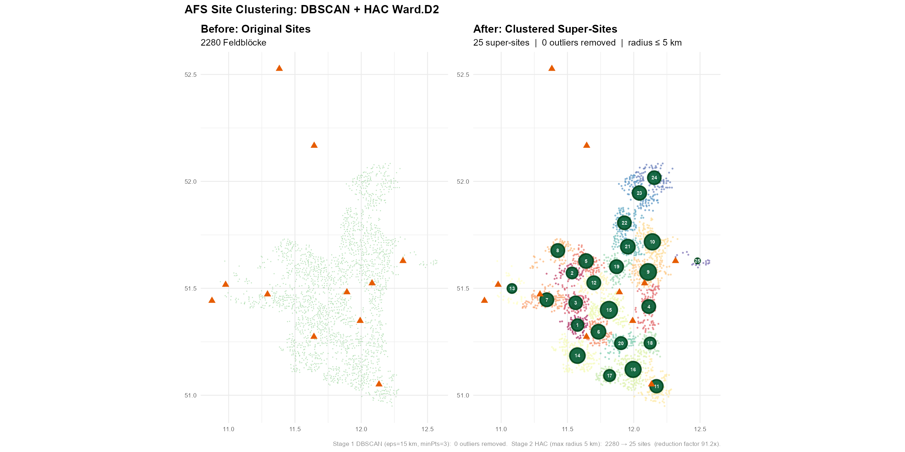

## Overview {.unnumbered}

::: {.nonincremental}
1. **Introduction** — Motivation & Research Gap
2. **Literature Review** — AFS Systems, Biomass Growth, Supply Chains
3. **MILP Model** — Sets, Variables, Objective, Constraints
4. **Case Study** — Central European Poplar-based AFS (Saxony-Anhalt)
5. **Optimization Results** — Supply Chain Configuration & Flows
6. **Conclusion** — Contributions & Open Questions
:::

# Introduction

## Motivation

- Temperate **agroforestry systems (AFS)** integrate fast-growing trees (poplar, willow) into arable land via alley-cropping
- Woody biomass from AFS is a **sustainable feedstock** for bio-based value chains — preferred over pure energy use as biogenic carbon is stored in products
- In Germany: ~1,200 ha of silvoarable AFS in 2025 — only **0.02 %** of agricultural land despite substantial ecological benefits
- **Core challenge:** coordinated decisions on stand establishment, multi-cycle harvesting, and product cascading in spatially distributed supply chains

::: {.callout-note}
## Research question
How can integrated MILP models link **age-dependent stand dynamics** at field sites to **regional supply chain design** for multi-product AFS biomass?
:::

## Research Gap & Contributions

**Prior literature** on biomass supply chains (MILP) typically:

- treats biomass availability as **exogenous input**
- focuses on a **single downstream value chain** (e.g. bioenergy)
- ignores **age-lag constraints** linking consecutive harvests

**This paper contributes:**

1. Novel **MILP formulation** (AFS-SCD) with explicit age-lag constraints enforcing minimum/maximum rotation ages
2. **Allometric yield functions** (Gompertz) for age-specific, component-specific biomass fractions (stems, branches, residues)
3. **Multi-product, multi-period network design** with product quality cascades and storage
4. Application to a **real-world case study** in Central Germany

# Literature Review

## Agroforestry System Types

:::: {.columns}
::: {.column width="50%"}
**Short-rotation coppice (SRC)**

- Monoculture, 8,000–20,000 cuttings/ha
- Rotation: 3–7 years, stand lifetime: 20–25 years
- Root system regenerates after harvest — no replanting
- Benchmark for biomass production

**Short-rotation AFS (SRAFS)**

- SRC-type tree strips in alley-cropping arrangement
- Trees cover 10–30 % of parcel area
- Boundary effect: higher light & water → higher individual-tree biomass
:::
::: {.column width="50%"}
**Long-rotation AFS (LRAFS)**

- Same spatial structure as SRAFS
- Rotation cycles: 12–15+ years
- Larger stem diameter → high-value timber (veneer, sawlogs, engineered wood)
- Timber-quality species: walnut, cherry, oak, high-grade poplar

::: {.callout-note}
## Key insight
SRAFS and LRAFS are not sharply separated — **intended use, establishment decisions, and harvest timing** jointly determine economic viability.
:::
:::
::::

## Biomass Growth Models

**Gompertz growth function** for above-ground biomass $B_{AG}(t)$:

$$B_{AG}(t) = A \cdot \exp\!\bigl(-\exp(-k(t - t_0))\bigr)$$

Component-specific fractions (stems $p=1$, branches $p=2$, residues $p=3$):

$$B_{AG,p}(t) = B_{AG}(t) \cdot \frac{h_p(t)}{h_1(t)+h_2(t)+h_3(t)}$$

- Parameters calibrated from SRAFS field trials in Southern Germany [@Huber2018_SRAFS_growth]
- Age-specific yield coefficients $\eta_{p,a}$ pre-computed and embedded in the MILP (constraints C3)

## Gompertz Growth Curves — Poplar Max 3

:::: {.columns}
::: {.column width="55%"}
{fig-align="center" width="100%"}
:::
::: {.column width="45%"}
**Key observations:**

- Stem share rises from ~55 % at age 4 to >75 % at age 10
- Growth peak (inflection) at ~age 4
- Total AGB at age 10: ~65 t dry matter/ha
- Component fractions $f_p(t)$ determine yield coefficients $\eta_{p,a}$ in constraint C3
:::
::::

## Biomass Supply Chain Literature

| Aspect | State of the art | This paper |
|---|---|---|
| Biomass availability | Exogenous or simplified | Endogenous via Gompertz + age-lag |
| Rotation decisions | Not modelled | Binary $z_{ist}$ with min/max age |
| Product types | Single or aggregated | Multi-product cascade $(p', p) \in \mathcal{Q}$ |
| Network structure | Static | Multi-period, storage + processing |
| Case study scope | Generic | Real SRC sites, Saxony-Anhalt |

: Literature gap summary {.striped}

# MILP Model (AFS-SCD)

## Sets, Indices & Parameters

:::: {.columns}
::: {.column width="50%"}
**Sets & indices**

| Symbol | Meaning |
|---|---|
| $\mathcal{I}$ | AFS sites (field parcels) |
| $\mathcal{J}$ | Storage/processing facilities |
| $\mathcal{K}$ | Industrial consumers |
| $\mathcal{P}$ | Biomass product types |
| $\mathcal{Q}$ | Quality cascade pairs $(p', p)$ |
| $\mathcal{T}$ | Planning periods |
| $\mathcal{S}$ | Feasible activity arcs $(s, t)$ |

:::
::: {.column width="50%"}
**Key parameters**

| Symbol | Meaning |
|---|---|
| $\eta_{p,a}$ | Yield (t/ha) for product $p$ at age $a$ |
| $\text{AREA}_i$ | Site area (ha) |
| $c^{est}_i$ | Establishment cost (€/ha) |
| $c^{harv}_i$ | Harvest cost (€/ha) |
| $c^{opp}_i$ | Opportunity cost (€/ha/yr) |
| $R_{kp}$ | Revenue (€/t) at consumer $k$ |
| $d_{ij}, d_{jk}$ | Transport distances (km) |

:::
::::

## Supply Chain Network Structure

{fig-align="center" width="90%"}

## Age-Lag Arc Structure $\mathcal{S}$

:::: {.columns}
::: {.column width="50%"}
{fig-align="center" width="100%"}
:::
::: {.column width="50%"}
{fig-align="center" width="100%"}
:::
::::

## Age-Lag Path Examples

:::: {.columns}
::: {.column width="50%"}
{fig-align="center" width="100%"}
:::
::: {.column width="50%"}
{fig-align="center" width="100%"}
:::
::::

## Decision Variables

| Variable | Type | Meaning |
|---|---|---|
| $z_{ist} \in \{0,1\}$ | Binary | Activity arc: site $i$ from age $s$ to $t$ (establishment, harvest, or termination) |
| $X_{ijpt} \geq 0$ | Continuous | Biomass flow (t): site $i$ → storage $j$, product $p$, period $t$ |
| $X_{jkp'pt} \geq 0$ | Continuous | Processed flow (t): storage $j$ → consumer $k$, cascade $(p',p)$ |
| $S_{jpt} \geq 0$ | Continuous | Inventory (t) at storage $j$, product $p$, end of period $t$ |

::: {.callout-note}
## Age-lag structure
Arc $(s,t) \in \mathcal{S}^{harv}$ is only feasible if $A_{min} \leq t-s \leq A_{max}$,
enforcing rotation age bounds without additional constraints.
:::

## Objective Function

**Maximise total contribution margin** over the planning horizon $\mathcal{T}$:

$$
\max\; Z = \underbrace{\sum_{k,p} R_{kp} \sum_{j,(p',p),t} X_{jkp'pt}}_{\text{Revenue}} - \underbrace{C^{est} - C^{opp} - C^{main} - C^{harv}}_{\text{Site costs}} - \underbrace{C^{tr\text{-}raw} + C^{tr\text{-}pre}}_{\text{Transport costs}} - \underbrace{C^{stor}}_{\text{Storage costs}}
$$

- **Opportunity costs** penalise foregone crop revenues for each year a site is under AFS
- **Two-stage transport** distinguishes raw biomass (site → storage) from pre-treated biomass (storage → consumer)
- **Storage costs** apply from year 2 onward (year-of-harvest drying is cost-free)

## Constraints (C1–C4)

**(C1) Single establishment per site:**
$$\sum_{(0,t)\in\mathcal{S}^{est}} z_{i0t} \leq 1 \qquad \forall\; i \in \mathcal{I}$$

**(C2) Path connectivity — flow conservation:**
$$\sum_{(s,t)\in\mathcal{S}} z_{ist} = \sum_{(t,u)\in\mathcal{S}} z_{itu} \qquad \forall\; i,\; t$$

**(C3) Biomass yield via Gompertz coefficients:**
$$\sum_{j} X_{ijpt} \leq \sum_{(s,t)\in\mathcal{S}^{harv}} \eta_{p(t-s)} \cdot \text{AREA}_i \cdot z_{ist} \qquad \forall\; i,p,t$$

**(C4)/(C5) Transport linkage & inventory balance** — follows OPTIMASS network-flow structure [@DeMeyer2015_OPTIMASS]

## Constraints (C6–C8) & Cascade Logic

**(C6) Storage capacity:**
$$\sum_{p} S_{jpt} \leq \text{CAP}^{stor}_j \qquad \forall\; j,\; t$$

**(C7) Processing capacity:**
$$\sum_{i,p} X_{ijpt} \leq \text{CAP}^{proc}_j \qquad \forall\; j,\; t$$

**(C8) Demand with quality cascade:**
$$\sum_{j,(p',p)\in\mathcal{Q}} X_{jkp'pt} \leq D^{max}_{kpt} \qquad \forall\; k,p,t$$

::: {.callout-note}
## Product cascade principle
$(p',p) \in \mathcal{Q}$ allows a **higher-quality product** $p'$ (e.g. stems) to satisfy demand for a **lower-quality product** $p$ (e.g. chips for energy) — operationalising cascading use as the central economic rationale.
:::

# Case Study

## Study Region & Supply Chain Configuration

- **Region:** tri-state area of Saxony-Anhalt, northern Thuringia, northern Saxony (Germany)
- Highest density of registered SRC *Feldblöcke* in Germany
- **Supply chain structure:** AFS sites (sources) → storage/processing nodes → industrial consumers (sinks)

:::: {.columns}
::: {.column width="50%"}
**Sites $\mathcal{I}$**

- Registered SRC parcels from INVEKOS land-use register
- Clustered into representative site groups
- Site-specific area, establishment/harvest costs
:::
::: {.column width="50%"}
**Consumers $\mathcal{K}$**

- 3 biomass product types: stems (P1), branches (P2), residues (P3)
- Industrial consumers: paper/pulp, chemical biorefinery, energy plants
- Minimum demand threshold: $\geq$ 1.5 units/period
:::
::::

## Site Clustering

{fig-align="center" width="90%"}

## Supply Chain Network — Saxony-Anhalt

{fig-align="center" width="85%"}

## Consumer Demand & Product Classification

:::: {.columns}
::: {.column width="55%"}
{fig-align="center" width="100%"}
:::
::: {.column width="45%"}
| Product | Type | Primary use | Cascade target |
|---|---|---|---|
| P1 — Stems | High quality | Sawlogs, pulp, engineered wood | Can supply P2, P3 demand |
| P2 — Branches | Medium quality | Chips, biomass boards | Can supply P3 demand |
| P3 — Residues/twigs | Low quality | Energy (combustion, biogas) | End of cascade |
:::
::::

## MILP Model Parameters

| Parameter | Value | Source |
|---|---|---|
| Planning horizon $\vert\mathcal{T}\vert$ | 40 periods | — |
| Max. rotation age $A_{max}$ | 15 years | LRAFS benchmark |
| Min. rotation age $A_{min}$ | 3 years | SRAFS minimum |
| Raw biomass transport $c^{tr\text{-}raw}$ | 0.08 €/(tkm) | Literature |
| Pre-treated transport $c^{tr\text{-}pre}$ | 0.06 €/(tkm) | Literature |
| Establishment cost $c^{est}$ | 2,500 €/ha | [@Testa2014_Poplar_Economics] |
| Harvest cost $c^{harv}$ | 150 €/ha | Literature |
| Opportunity cost $c^{opp}$ | 45 €/ha/yr | Literature |
| Solver | Gurobi 10, MIP gap 1 % | — |

# Optimization Results

## Supply Chain Network — Optimal Configuration

{fig-align="center" width="88%"}

## Harvest & Rotation Patterns

{fig-align="center" width="95%"}

::: {.callout-note}
## Trade-off
Longer rotations → higher stem share & revenue per harvest  
Shorter rotations → more frequent harvests, lower capital tie-up, better demand coverage
:::

## Product Mix & Biomass Flows

{fig-align="center" width="95%"}

## Inventory Dynamics at Storage Nodes

{fig-align="center" width="95%"}

# Conclusion

## Contributions & Key Findings

**Novel MILP formulation (AFS-SCD):** explicit age-lag constraints link establishment and consecutive harvest decisions — first integrated AFS supply chain model of this type

**Allometric Gompertz yield functions** embedded directly in the MILP via pre-computed $\eta_{p,a}$ coefficients — no exogenous biomass input needed

**Multi-product cascade** operationalises cleaner production principle: high-quality material use before energy recovery

**Real-world case study** (Saxony-Anhalt) demonstrates feasibility at regional scale

## Open Research Questions

::: {.callout-important}
## Planned computational experiments
- **Allometric parameter uncertainty:** sensitivity of optimal rotation length to Gompertz parameter ranges
- **Price scenarios:** impact of biomass price trajectories (P1/P2/P3) on product mix and supply chain configuration
- **Policy incentives:** effect of AFS subsidies and carbon pricing on establishment decisions
- **Scalability:** solution quality and computation time for larger site/consumer instances
:::

. . .

**Further directions:**
- Stochastic programming extensions for yield and demand uncertainty
- Multi-objective optimization (economic vs. ecological performance)
- Integration of ecosystem service valuations (carbon sequestration, biodiversity)

## Thank You {.center}

{height=52px style="margin-bottom:1rem;"}

**Questions?**

Thomas Kirschstein  
Fraunhofer IKTS
thomas.kirschstein@ikts.fraunhofer.de

## References {.unnumbered}

::: {#refs}
:::
